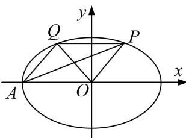
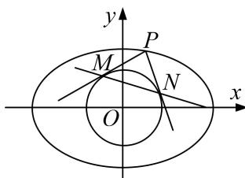

<!-- question-source:start -->
[例12] 已知 $A$ ， $F$ 分别是椭圆 $C: \frac{x^2}{a^2} + \frac{y^2}{b^2} = 1 (a > b > 0)$ 的左顶点、右焦点，点 $P$ 为椭圆 $C$ 上一动点，当 $PF \perp x$ 轴时， $|AF| = 2|PF|$ .

(1)求椭圆 C 的离心率;

(2)若椭圆 $C$ 上存在点 $Q$ ，使得四边形 $AOPQ$ 是平行四边形(点 $P$ 在第一象限)，求直线 $AP$ 与 $OQ$ 的斜率之积；

(3)记圆 $O: x^{2} + y^{2} = \frac{ab}{a^{2} + b^{2}}$ 为椭圆 $C$ 的“关联圆”。若 $b = \sqrt{3}$ ，过点 $P$ 作椭圆 $C$ 的“关联圆”的两条切线，切点为 $M, N$ ，直线 $MN$ 在 $x$ 轴和 $y$ 轴上的截距分别为 $m, n$ ，求证： $\frac{3}{m^2} + \frac{4}{n^2}$ 为定值。

(2)图

(3)图

(2)因为四边形 AOPQ 是平行四边形，所以 PQ=a 且 PQ//x 轴，

所以 $x_{P} = \frac{a}{2}$ ，代入椭圆 $C$ 的方程，解得 $y_{P} = \pm \frac{\sqrt{3}}{2} b,$

因为点 $P$ 在第一象限，所以 $y_{P} = \frac{\sqrt{3}}{2} b$ ，同理可得 $x_{Q} = -\frac{a}{2}, y_{Q} = \frac{\sqrt{3}}{2} b,$

所以 $k_{AP}k_{OQ}=\frac{\frac{\sqrt{3}b}{2}}{\frac{a}{2}-(-a)}\cdot\frac{\frac{\sqrt{3}b}{2}}{-\frac{a}{2}}=-\frac{b^{2}}{a^{2}}$ ，由(1)知 $e=\frac{c}{a}=\frac{1}{2}$ ，得 $\frac{b^{2}}{a^{2}}=\frac{3}{4}$ ，所以 $k_{AP}k_{OQ}=-\frac{3}{4}$ .

(3)由(1)知 $e=\frac{c}{a}=\frac{1}{2}$ ，又 $b=\sqrt{3}$ ，解得 a=2，所以椭圆 C 的方程为 $\frac{x^{2}}{4}+\frac{y^{2}}{3}=1$ ，

圆 O 的方程为 $x^{2}+y^{2}=\frac{2\sqrt{3}}{7}$ ，①

连接 OM, ON(图略), 由题意可知, $OM \perp PM$ , $ON \perp PN$ ,

所以四边形 OMPN 的外接圆是以 OP 为直径的圆，

设 $P(x_0, y_0)$ ，则四边形 OMPN 的外接圆方程为 $\left[x - \frac{x_0}{2}\right]^2 + \left(y - \frac{y_0}{2}\right)^2 = \frac{1}{4}(x_0^2 + y_0^2)$ ，

即 $x^{2} - xx_{0} + y^{2} - yy_{0} = 0$ ，②

①-②，得直线 $MN$ 的方程为 $xx_0 + yy_0 = \frac{2\sqrt{3}}{7}$ ，令 $y = 0$ ，则 $m = \frac{2\sqrt{3}}{7x_0}$ ，令 $x = 0$ ，则 $n = \frac{2\sqrt{3}}{7y_0}$ 。所以 $\frac{3}{m^2} + \frac{4}{n^2} = 49\left(\frac{x_0^2}{4} + \frac{y_0^2}{3}\right)$ ，因为点 $P$ 在椭圆 $C$ 上，所以 $\frac{x_0^2}{4} + \frac{y_0^2}{3} = 1$ ，所以 $\frac{3}{m^2} + \frac{4}{n^2} = 49$ （为定值）。
<!-- question-source:end -->

![[高中/总复习/专题/圆锥曲线/专题19  距离型定值型问题-圆锥曲线/专题19_距离型定值型问题/例题选讲/例题/answers/Q00032528A1.md]]
