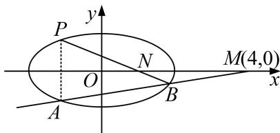

<!-- question-source:start -->
1. 在平面直角坐标系 $xOy$ 中，过点 $M(4, 0)$ 且斜率为 $k$ 的直线交椭圆 $\frac{x^2}{4} + y^2 = 1$ 于 $A, B$ 两点.

(1)求 $k$ 的取值范围；

(2)当 $k \neq 0$ 时，若点 $A$ 关于 $x$ 轴为对称点为 $P$ ，直线 $BP$ 交 $x$ 轴于点 $N$ ，求证： $|ON|$ 为定值.

<!-- question-source:end -->

![[高中/总复习/专题/圆锥曲线/专题19  距离型定值型问题-圆锥曲线/专题19_距离型定值型问题/对点训练/题目/answers/Q00032529A1.md]]
