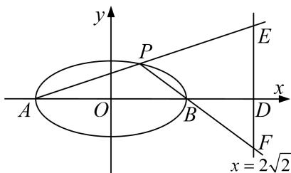

<!-- question-source:start -->
5. 已知椭圆 $C: \frac{x^2}{a^2} + \frac{y^2}{b^2} = 1 (a > b > 0)$ 的离心率为 $\frac{\sqrt{3}}{2}$ ，且过点(0，1).

(1)求椭圆 C 的方程;

(2)若点 A、B 为椭圆 C 的左右顶点，直线 l: $x=2\sqrt{2}$ 与 x 轴交于点 D，点 P 是椭圆 C 上异于 A、B 的动点，直线 AP、BP 分别交直线 l 于 E、F 两点，当点 P 在椭圆 C 上运动时， $|DE|\cdot|DF|$ 是否为定值？若是，请求出该定值；若不是，请说明理由.

<!-- question-source:end -->

![[高中/总复习/专题/圆锥曲线/专题19  距离型定值型问题-圆锥曲线/专题19_距离型定值型问题/对点训练/题目/answers/Q00032533A1.md]]
