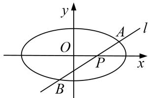

<!-- question-source:start -->
7. 已知椭圆 $C: \frac{x^2}{a^2} + \frac{y^2}{b^2} = 1 (a > b > 0)$ 的离心率为 $\frac{3}{5}$ , 过左焦点 $F$ 且垂直于长轴的弦长为 $\frac{32}{5}$ .

(1)求椭圆 C 的标准方程;

(2)点 $P(m, 0)$ 为椭圆 C 的长轴上的一个动点，过点 P 且斜率为 $\frac{4}{5}$ 的直线 l 交椭圆 C 于 A, B 两点，证明： $|PA|^{2} + |PB|^{2}$ 为定值.

<!-- question-source:end -->

![[高中/总复习/专题/圆锥曲线/专题19  距离型定值型问题-圆锥曲线/专题19_距离型定值型问题/对点训练/题目/answers/Q00032535A1.md]]
