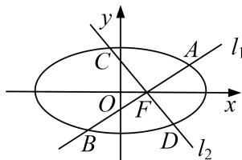

<!-- question-source:start -->
8. 设 $O$ 为坐标原点，动点 $M$ 在椭圆 $\frac{x^2}{9} + \frac{y^2}{4} = 1$ 上，过 $M$ 作 $x$ 轴的垂线，垂足为 $N$ ，点 $P$ 满足 $\overrightarrow{NP} = \sqrt{2}\overrightarrow{NM}$

(1)求点 $P$ 的轨迹 $E$ 的方程;

(2)过 $F(1,0)$ 的直线 $l_{1}$ 与点 $P$ 的轨迹交于 $A,B$ 两点，过 $F(1,0)$ 作与 $l_{1}$ 垂直的直线 $l_{2}$ 与点 $P$ 的轨迹交于 $C,D$ 两点，求证： $\frac{1}{|AB|} +\frac{1}{|CD|}$ 为定值.

<!-- question-source:end -->

![[高中/总复习/专题/圆锥曲线/专题19  距离型定值型问题-圆锥曲线/专题19_距离型定值型问题/对点训练/题目/answers/Q00032536A1.md]]
