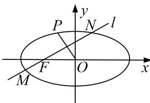

<!-- question-source:start -->
9. 已知椭圆 $C: \frac{x^2}{a^2} + \frac{y^2}{b^2} = 1 (a > b > 0)$ 的焦距为 $2\sqrt{3}$ , 斜率为 $\frac{1}{2}$ 的直线与椭圆交于 $A, B$ 两点, 若线段 $AB$ 的中点为 $D$ , 且直线 $OD$ 的斜率为 $-\frac{1}{2}$ .

(1)求椭圆 C 的方程;

(2)若过左焦点 F 斜率为 k 的直线 l 与椭圆交于 M, N 两点，P 为椭圆上一点，且满足 $OP \perp MN$ ，问： $\frac{1}{|MN|} + \frac{1}{|OP|^{2}}$ 是否为定值？若是，求出此定值；若不是，说明理由.

<!-- question-source:end -->

![[高中/总复习/专题/圆锥曲线/专题19  距离型定值型问题-圆锥曲线/专题19_距离型定值型问题/对点训练/题目/answers/Q00032537A1.md]]
