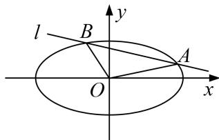

<!-- question-source:start -->
[例1] 已知椭圆 $C: \frac{x^2}{a^2} + \frac{y^2}{b^2} = 1 (a > b > 0)$ 的离心率为 $\frac{1}{2}$ ，以原点 $O$ 为圆心，椭圆的短半轴长为半径的圆与直线 $x - y + \sqrt{6} = 0$ 相切.

(1)求椭圆 C 的标准方程;

(2)若直线 $l: y = kx + m$ 与椭圆 $C$ 相交于 $A, B$ 两点，且 $k_{OA} \cdot k_{OB} = -\frac{b^2}{a^2}$ . 求证： $\triangle AOB$ 的面积为定值.

[规范解答]
(1)由题意得 $\left\{ \begin{array}{l} \frac{c}{a} = \frac{1}{2} \\ b = \frac{|0 - 0 + \sqrt{6}|}{\sqrt{2}} \\ a^2 = c^2 + b^2 \end{array} \right.$ ， $\therefore a^2 = 4, b^2 = 3$ ， $\therefore$ 椭圆的方程为 $\frac{x^2}{4} + \frac{y^2}{3} = 1$ ；

(2)设 $A(x_{1}, y_{1})$ ， $B(x_{2}, y_{2})$ ，则 A, B 的坐标满足 $\left\{\begin{aligned}\frac{x^{2}}{4}+\frac{y^{2}}{3}&=1\\ y=kx+m\end{aligned}\right.$ ，

消去 y 化简得 $(3+4k^{2})x^{2}+8kmx+4m^{2}-12=0$ ， $x_{1}+x_{2}=-\frac{8km}{3+4k^{2}}$ ， $x_{1}x_{2}=\frac{4m^{2}-12}{3+4k^{2}}$

由 $\Delta>0$ ，得 $m^{2}4k^{2}-m^{2}+3>0$ ，

$$
y _ {1} y _ {2} = \left(k x _ {1} + m\right) \left(k x _ {2} + m\right) = k ^ {2} x _ {1} x _ {2} + k m \left(x _ {1} + x _ {2}\right) + m ^ {2} = k ^ {2} \frac {4 m ^ {2} - 1 2}{3 + 4 k ^ {2}} + k m \left(- \frac {8 k m}{3 + 4 k ^ {2}}\right) + m ^ {2} = \frac {3 m ^ {2} - 1 2 k ^ {2}}{3 + 4 k ^ {2}}.
$$

$\because k_{OA} \cdot k_{OB} = -\frac{b^2}{a^2} = -\frac{3}{4}, \therefore \frac{y_1 y_2}{x_1 x_2} = -\frac{3}{4}$ , 即 $y_1 y_2 = -\frac{3}{4} x_1 x_2, \therefore \frac{3m^2 - 12k^2}{3 + 4k^2} = -\frac{3}{4} \cdot \frac{4m^2 - 12}{3 + 4k^2}$ . 即 $2m^2 - 4k^2 = 3$

$$
\left| M N \right| = \sqrt {1 + k ^ {2}} \cdot \left| x _ {1} - x _ {2} \right| = \sqrt {1 + k ^ {2}} \cdot \sqrt {\left(x _ {1} + x _ {2}\right) ^ {2} - 4 x _ {1} x _ {2}} = \sqrt {1 + k ^ {2}} \cdot \sqrt {\left(\frac {- 8 k m}{3 + 4 k ^ {2}}\right) ^ {2} - 4 \left(\frac {4 m ^ {2} - 1 2}{3 + 4 k ^ {2}}\right)} = \sqrt {\frac {2 4 (1 + k ^ {2})}{3 + 4 k ^ {2}}}.
$$

又由点 O 到直线 $y=kx+m$ 的距离 $d=\frac{|m|}{\sqrt{1+k^{2}}}$ ,

所以 $S_{\triangle MON}=\frac{1}{2}|AB|\cdot d=\frac{1}{2}\frac{|m|}{\sqrt{1+k^{2}}}\cdot\sqrt{\frac{24(1+k^{2})}{3+4k^{2}}}=\frac{1}{2}\cdot\sqrt{\frac{m^{2}}{1+k^{2}}\cdot\frac{24(1+k^{2})}{3+4k^{2}}}=\frac{1}{2}\cdot\sqrt{\frac{3+4k^{2}}{2}\cdot\frac{24}{3+4k^{2}}}=\sqrt{3}$ 为定值.
<!-- question-source:end -->
