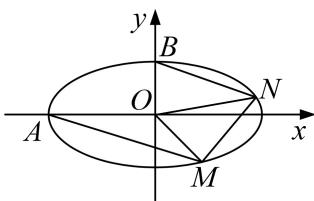

<!-- question-source:start -->
[例5] 已知椭圆 $C: \frac{x^2}{a^2} + \frac{y^2}{b^2} = 1 (a > b > 0)$ 的离心率为 $\frac{\sqrt{3}}{2}$ ，过点 $P(1, \frac{\sqrt{3}}{2})$ .

(1)求椭圆 C 的标准方程;

(2)设点 $A$ 、 $B$ 分别是椭圆 $C$ 的左顶点和上顶点， $M$ 、 $N$ 为椭圆 $C$ 上异于 $A$ 、 $B$ 的两点，满足 $AM \parallel BN$ ，求证： $\triangle OMN$ 面积为定值.

[规范解答]
(1)由已知条件可得 $\left\{ \begin{array}{l} \frac{c}{a} = \frac{\sqrt{3}}{2} \\ \frac{1}{a^2} + \frac{3}{4b^2} = 1 \\ a^2 = c^2 + b^2 \end{array} \right.$ ，解得 $a^2 = 4$ ， $b^2 = 1$ ，故椭圆 $C$ 的标准方程为 $\frac{x^2}{4} +$

$$
y ^ {2} = 1
$$

(2)设 $M(x_{1}, y_{1})$ ， $N(x_{2}, y_{2})$ ，由题意直线 AM、BN 的斜率存在，

设直线 AM 的方程为 $y=k(x+2)$ ①，设直线 BN 的方程为 $y=kx+1$ ②，

由
(1)椭圆 C: $\frac{x^{2}}{4} + y^{2} = 1③$ ,

联立①③得 $(4k^{2}+1)x^{2}+16k^{2}x+16k^{2}-4=0$ ，解得 $x_{1}=\frac{2-8k^{2}}{4k^{2}+1}$ ，即 $M(\frac{2-8k^{2}}{4k^{2}+1},\frac{4k}{4k^{2}+1})$

联立②③，得 $(4k^{2}+1)x^{2}+8kx=0$ ，所以， $x_{2}=-\frac{8k}{4k^{2}+1}$ ，即 $N(-\frac{8k}{4k^{2}+1},\frac{1-4k^{2}}{4k^{2}+1})$

易知 $|OM|=\sqrt{x_{1}^{2}+y_{1}^{2}}$

直线 $OM$ 的方程为 $y_{1}x - x_{1}y = 0$ ，点 $N$ 到直线 $OM$ 的距离为 $\frac{|x_2y_1 - x_1y_2|}{\sqrt{x_1^2 + y_1^2}}$ 所以 $S_{\triangle OMN} = \frac{1}{2} |OM|\cdot d = \frac{|x_2y_1 - x_1y_2|}{2} = \frac{1}{2} | - \frac{8k}{4k^2 + 1}\cdot \frac{4k}{4k^2 + 1} -\frac{1 - 4k^2}{4k^2 + 1}\cdot \frac{2 - 8k^2}{4k^2 + 1}| = 1$ 故 $\triangle OMN$ 面积为定值1.
<!-- question-source:end -->
