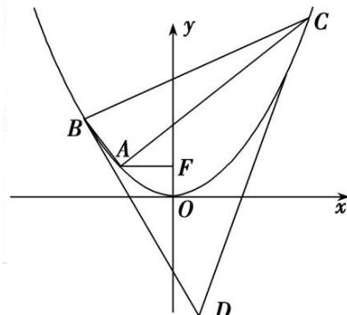

<!-- question-source:start -->
[例 6] 如图，点 F 是抛物线 $\Gamma: x^{2}=2py(p>0)$ 的焦点，点 A 是抛物线上的定点，且 $\overrightarrow{AF}=(2,0)$ ，点 B，C 是抛物线上的动点，直线 AB，AC 的斜率分别为 $k_{1}, k_{2}$ .

(1)求抛物线 $\Gamma$ 的方程;

(2)若 $k_{2}-k_{1}=2$ ，点 D 是抛物线在点 B，C 处切线的交点，记 $\triangle BCD$ 的面积为 S，证明 S 为定值.

[规范解答]
(1) 设 $A(x_{0}, y_{0})$ ，由题知 $F(0, \frac{p}{2})$ ，所以 $\overrightarrow{AF}=(-x_{0}, \frac{p}{2}-y_{0})=(2, 0)$ ,

所以 $\left\{ \begin{array}{l} x_0 = -2, \\ y_0 = \frac{p}{2} \end{array} \right.$ ，代入 $x^2 = 2py (p > 0)$ ，得 $4 = p^2$ ，得 $p = 2$

所以抛物线的方程是 $x^{2}=4y$ .

(2)过 D 作 y 轴的平行线交 BC 于点 E，并设 $B(x_{1}, \frac{x_{1}^{2}}{4})$ ， $C(x_{2}, \frac{x_{2}^{2}}{4})$ ，由
(1)知 A(-2, 1)，

所以 $k_{2}-k_{1}=\frac{\frac{x_{2}^{2}}{4}-1}{x_{2}+2}-\frac{\frac{x_{1}^{2}}{4}-1}{x_{1}+2}=\frac{x_{2}-x_{1}}{4}$ ，又 $k_{2}-k_{1}=2$ ，所以 $x_{2}-x_{1}=8$ 。

直线 BD: $y=\frac{x_{1}}{2}x-\frac{x_{1}^{2}}{4}$ ，直线 CD: $y=\frac{x_{2}}{2}x-\frac{x_{2}^{2}}{4}$ ，解得 $\left\{\begin{aligned}x_{D}&=\frac{x_{1}+x_{2}}{2},\\ y_{D}&=\frac{x_{1}x_{2}}{4}.\end{aligned}\right.$

因直线 BC 的方程为 $y - \frac{x_{1}^{2}}{4} = \frac{x_{1} + x_{2}}{4}(x - x_{1})$ ，将 $x_{D}$ 代入得 $y_{E} = \frac{x_{1}^{2} + x_{2}^{2}}{8}$ ,

所以 $S = \frac{1}{2} |DE|(x_2 - x_1) = \frac{1}{2}(y_E - y_D)(x_2 - x_1) = \frac{1}{2}\cdot \frac{(x_2 - x_1)^2}{8} (x_2 - x_1) = 32.$

## 【对点训练】
<!-- question-source:end -->
