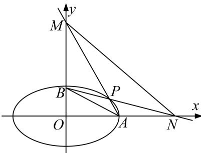

<!-- question-source:start -->
[例7] 已知椭圆 $C: \frac{x^2}{a^2} + \frac{y^2}{b^2} = 1 (a > b > 0)$ 的右顶点为 $A(2, 0)$ ，离心率 $e = \frac{\sqrt{3}}{2}$ .

(1)求椭圆 C 的方程;

(2)设 $B$ 为椭圆上顶点， $P$ 是椭圆 $C$ 在第一象限上的一点，直线 $PA$ 与 $y$ 轴交于点 $M$ ，直线 $PB$ 与 $x$ 轴交于点 $N$ ，问 $\triangle PMN$ 与 $\triangle PAB$ 面积之差是否为定值？说明理由.

[规范解答]
<!-- question-source:end -->

![[高中/总复习/专题/圆锥曲线/专题20  面积型定值型问题-圆锥曲线/专题20__面积型定值型问题/例题/answers/Q00042529A1.md]]
