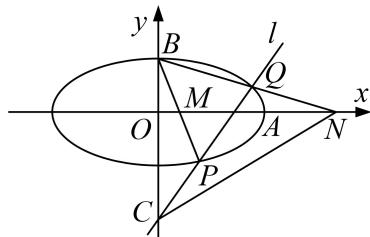

<!-- question-source:start -->
[例 8] 已知椭圆 C: $\frac{x^{2}}{a^{2}} + \frac{y^{2}}{b^{2}} = 1 (a > b > 0)$ 的离心率 e 满足 $2e^{2} - 3\sqrt{2}e + 2 = 0$ ，右顶点为 A，上顶点为 B，点 C(0, -2)，过点 C 作一条与 y 轴不重合的直线 l，直线 l 交椭圆 E 于 P，Q 两点，直线 BP，BQ 分别交 x 轴于点 M，N；当直线 l 经过点 A 时，l 的斜率为 $\sqrt{2}$ .

(1)求椭圆 E 的方程;

(2)证明： $S_{\triangle BOM} \cdot S_{\triangle BCN}$ 为定值.

[规范解答]
<!-- question-source:end -->

![[高中/总复习/专题/圆锥曲线/专题20  面积型定值型问题-圆锥曲线/专题20__面积型定值型问题/例题/answers/Q00042530A1.md]]
