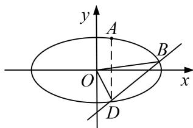

<!-- question-source:start -->
4. 已知椭圆 $C: \frac{x^2}{a^2} + \frac{y^2}{b^2} = 1 (a > b > 0)$ 的左、右焦点分别为 $F_1, F_2$ ，椭圆 $C$ 与 $y$ 轴的一个交点为 $M$ ，且 $|F_1 F_2| = 2 \sqrt{3}$ ， $|MF_1| = 2$ .

(1)求椭圆 C 的标准方程;

(2)设 $O$ 为坐标原点， $A, B$ 为椭圆 $C$ 上不同的两点，点 $A$ 关于 $x$ 轴的对称点为点 $D$ 。若直线 $BD$ 的斜率为 1，求证： $\triangle OAB$ 的面积为定值。

<!-- question-source:end -->

![[高中/总复习/专题/圆锥曲线/专题20  面积型定值型问题-圆锥曲线/专题20__面积型定值型问题/对点训练/answers/Q00042526A1.md]]
