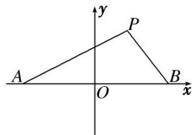

<!-- question-source:start -->
5. 如图，设点 $A$ ， $B$ 的坐标分别为 $(- \sqrt{3}, 0)$ ， $(\sqrt{3}, 0)$ ，直线 $AP$ ， $BP$ 相交于点 $P$ ，且它们的斜率之积为 $-\frac{2}{3}$ .

(1)求点 P 的轨迹方程;

(2)设点 P 的轨迹为 C，点 M，N 是轨迹 C 上不同于 A，B 的两点，且满足 $AP \parallel OM$ ， $BP \parallel ON$ ，求证： $\triangle MON$ 的面积为定值.

<!-- question-source:end -->

![[高中/总复习/专题/圆锥曲线/专题20  面积型定值型问题-圆锥曲线/专题20__面积型定值型问题/对点训练/answers/Q00042527A1.md]]
