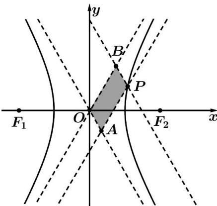

> [!faq]- 《专题20  面积型定值型问题-圆锥曲线》例题解析
>
> > [!success]- **【答案】** 详见解析
>
> > [!note]- **【分析】**
> > 本题未单列分析。
>
> > [!note]- **【解析】**
> > (1)求四边形 OAPB 的面积;
> > (2)若对于更一般的双曲线 $C'$ : $\frac{x^2}{a^2} - \frac{y^2}{b^2} = 1 (a > 0, b > 0)$ , 点 $P'$ 为双曲线 $C'$ 上任意一点, 过点 $P'$ 分别作双曲线 $C'$ 两条渐近线的平行线 $P'A'$ 、 $P'B'$ 与渐近线的交点分别是 $A'$ 和 $B'$ . 请问四边形 $OA' P'B'$ 的面积为定值吗? 若是定值, 求出该定值 (用 $a$ 、 $b$ 表示该定值); 若不是定值, 请说明理由.
> > 
> > 9. 解析
> > (1)因为双曲线 $C: x^{2} - \frac{y^{2}}{3} = 1$ ，由双曲线的定义可得 $|PF_{1}| - |PF_{2}| = 2$ ，又因为 $|PF_{1}| + |PF_{2}| = 8$ ， $\therefore |PF_{1}| = 5$ ， $|PF_{2}| = 3$ ，因为 $|F_{1}F_{2}| = 2\sqrt{1 + 3} = 4$ ，所以， $|PF_{2}|^{2} + |F_{1}F_{2}|^{2} = |PF_{1}|^{2}$ ， $PF_{2} \perp x$ 轴， $\therefore$ 点 $P$ 的横坐标为 $x_{P} = 2$ ，所以， $2^{2} - \frac{y_{P}^{2}}{3} = 1$ ，因为 $y_{P} > 0$ ，可得 $y_{P} = 3$ ，即点 $P(2,3)$ ，过点 $P$ 且与渐近线 $y = -\sqrt{3}x$ 平行的直线的方程为 $y - 3 = -\sqrt{3}(x - 2)$ ，联立 $\left\{ \begin{array}{l} y = -\sqrt{3}x \\ y - 3 = -\sqrt{3}(x - 2) \end{array} \right.$ ，解得 $\left\{ \begin{array}{l} x = 1 + \frac{\sqrt{3}}{2} \\ y = \sqrt{3} + \frac{3}{2} \end{array} \right.$ ，即点 $B(1 + \frac{\sqrt{3}}{2}, \sqrt{3} + \frac{3}{2})$ ，直线 $OP$ 的方程为 $3x - 2y = 0$ ，点 $B$ 到直线 $OP$ 的距离为 $d = \frac{\frac{\sqrt{3}}{2}}{\sqrt{13}} = \frac{\sqrt{3}}{2\sqrt{13}}$ ，且 $|OP| = \sqrt{13}$ ，因此，四边形 $OAPB$ 的面积为 $2S_{\triangle OBP} = |OP| d = \frac{\sqrt{3}}{2}$ ；
> > (2)四边形 $OA'P'B'$ 的面积为定值 $\frac{1}{2} ab$ ，理由如下：设点 $P'(x_0, y_0)$ ，双曲线 $\frac{x^2}{a^2} - \frac{y^2}{b^2} = 1$ 的渐近线方程为 $y = \pm \frac{b}{a}x$ ，则直线 $P'B'$ 的方程为 $y - y_0 = -\frac{b}{a}(x - x_0)$ ，联立 $\left\{ \begin{array}{l} y - y_0 = -\frac{b}{a}(x - x_0) \\ y = \frac{b}{a}x \end{array} \right.$ ，解得 $\left\{ \begin{array}{l} x = \frac{x_0}{2} + \frac{a}{2b}y_0 \\ y = \frac{y_0}{2} + \frac{b}{2a}x_0 \end{array} \right.$ ，即点 $B'(\frac{x_0}{2} + \frac{a}{2b}y_0, \frac{y_0}{2} + \frac{b}{2a}x_0)$ ，直线 $OP'$ 的方程为 $y = \frac{y_0}{x_0}x$ ，即 $y_0x - x_0y = 0$ ，点 $B'$ 到直线 $OP'$ 的距离为 $d = \frac{|y_0(\frac{x_0}{2} + \frac{a}{2b}y_0) - x_0(\frac{y_0}{2} + \frac{b}{2a}x_0)|}{\sqrt{x_0^2 + y_0^2}}$ ， $\frac{|a^2y_0^2 - b^2x_0^2|}{2ab\sqrt{x_0^2 + y_0^2}} = \frac{a^2b^2}{2ab\sqrt{x_0^2 + y_0^2}} = \frac{ab}{2\sqrt{x_0^2 + y_0^2}}$ ，且 $|OP'| = \sqrt{x_0^2 + y_0^2}$ ，
> > 因此，四边形 $OA'P'B'$ 的面积为 $2S_{\triangle OB'}P' = \frac{ab}{2\sqrt{x_0^2 + y_0^2}}\sqrt{x_0^2 + y_0^2} = \frac{ab}{2}$ (定值).
