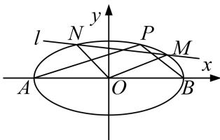

<!-- question-source:start -->
[例 2] 已知椭圆 C: $\frac{x^{2}}{a^{2}}+\frac{y^{2}}{b^{2}}=1(a>b>0)$ 的离心率为 $\frac{\sqrt{2}}{2}$ ，O 是坐标原点，点 A，B 分别为椭圆 C 的左右顶点， $|AB|=4\sqrt{2}$ .

(1)求椭圆 C 的标准方程.

(2)若 $P$ 是椭圆 $C$ 上异于 $A, B$ 的一点，直线 $l$ 交椭圆 $C$ 于 $M, N$ 两点， $AP \parallel OM, BP \parallel ON$ ，则 $\triangle OMN$

的面积是否为定值？若是，求出定值，若不是，请说明理由.

(2)由题意可得 $A(-2\sqrt{2},0)$ ， $B(2\sqrt{2},0)$ ，设 $P(x_{0},y_{0})$ ，可得 $\frac{x_{0}^{2}}{8}+\frac{y_{0}^{2}}{4}=1$ ，即 $x_{0}^{2}+2y_{0}^{2}=8$ ，

$$
k _ {A P} \cdot k _ {B P} = \frac {y _ {0}}{x _ {0} + 2 \sqrt {2}} \cdot \frac {y _ {0}}{x _ {0} - 2 \sqrt {2}} = \frac {y _ {0} ^ {2}}{x _ {0} ^ {2} - 8} = \frac {y _ {0} ^ {2}}{- 2 y _ {0} ^ {2}} = - \frac {1}{2},
$$

因为 $AP \parallel OM$ ， $BP \parallel ON$ ，则 $k_{OM} \cdot k_{ON} = k_{AP} \cdot k_{BP} = -\frac{1}{2}$

①当直线 l 的斜率不存在时，设 l: x=m，联立椭圆方程可得 $y=\pm\sqrt{\frac{8-m^{2}}{2}}$ ,

所以 $M(m, \sqrt{\frac{8-m^{2}}{2}})$ ， $N(m, -\sqrt{\frac{8-m^{2}}{2}})$ ，由 $k_{OM} \cdot k_{ON} = -\frac{1}{2}$ ，可得 $-\frac{\frac{8-m^{2}}{2}}{m^{2}} = -\frac{1}{2}$ ，解得 $m = \pm 2$ ，

所以 $M(\pm2, \sqrt{2})$ ， $N(\pm2, -\sqrt{2})$ ，所以 $S_{\triangle MNO}=\frac{1}{2}\times2\times2\sqrt{2}=2\sqrt{2}$ ;

②当直线 l 的斜率存在时，设直线 $l: y = kx + n, M(x_{1}, y_{1}), N(x_{2}, y_{2})$ ,

联立直线 $y=kx+n$ 和 $x^{2}+2y^{2}=8$ ，可得 $(1+2k^{2})x^{2}+4knx+2n^{2}-8=0$ ，

可得 $\therefore x_{1} + x_{2} = -\frac{4kn}{1 + 2k^{2}}, x_{1}x_{2} = \frac{2n^{2} - 8}{1 + 2k^{2}}, y_{1}y_{2} = (kx_{1} + n)(kx_{2} + n) = k^{2}x_{1}x_{2} + kn(x_{1} + x_{2}) + n^{2},$

由 $k_{OM} \cdot k_{ON} = \frac{y_1 y_2}{x_1 x_2} = k^2 + \frac{-4k^2 n^2}{2n^2 - 8} + \frac{n^2 (1 + 2k^2)}{2n^2 - 8} = -\frac{1}{2}$ ，可得 $n^2 = 2 + 4k^2$

由弦长公式可得， $|MN=|\sqrt{1+k^{2}}\cdot|x_{1}-x_{2}|=\sqrt{1+k^{2}}\cdot\sqrt{(x_{1}+x_{2})^{2}-4x_{1}x_{2}}$

$$
= \sqrt {1 + k ^ {2}} \cdot \sqrt {\left(- \frac {4 k n}{1 + 2 k ^ {2}}\right) ^ {2} - 4 \left(\frac {2 n ^ {2} - 8}{1 + 2 k ^ {2}}\right)} = \frac {\sqrt {1 + k ^ {2}}}{1 + 2 k ^ {2}} \cdot \sqrt {6 4 k ^ {2} - 8 n ^ {2} + 3 2} = \frac {4 \sqrt {1 + k ^ {2}}}{\sqrt {1 + 2 k ^ {2}}}.
$$

点(0, 0)到直线 l 的距离为 $d=\frac{|n|}{\sqrt{k^{2}+1}}=\frac{\sqrt{2(1+2k^{2})}}{\sqrt{1+k^{2}}}$ ,

所以 $S_{\triangle OMN}=\frac{1}{2}d\cdot|MN|=2\sqrt{2}$ ，综上可知， $\triangle OMN$ 的面积为定值 $2\sqrt{2}$ .
<!-- question-source:end -->

![[高中/总复习/专题/圆锥曲线/专题20  面积型定值型问题-圆锥曲线/专题20_面积型定值型问题/例题选讲/例题/answers/Q00032565A1.md]]
