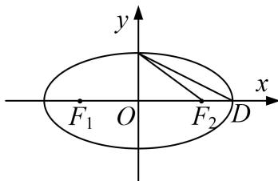
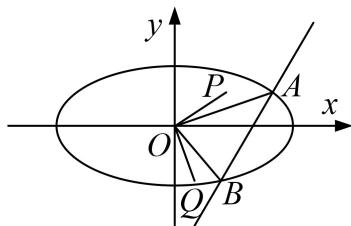

<!-- question-source:start -->
[例 3] 如图， $F_{1}$ 、 $F_{2}$ 为椭圆 C: $\frac{x^{2}}{a^{2}}+\frac{y^{2}}{b^{2}}=1(a>b>0)$ 的左、右焦点，D、E 是椭圆的两个顶点，椭圆的离心率为 $\frac{\sqrt{3}}{2}$ ， $S_{\triangle DEF2}=1-\frac{\sqrt{3}}{2}$ 。若 $M(x_{0}, y_{0})$ 在椭圆 C 上，则点 $N(\frac{x_{0}}{a}, \frac{y_{0}}{b})$ 称为点 M 的一个“好点”。直线 l 与椭圆交于 A、B 两点，A、B 两点的“好点”分别为 P、Q，已知以 PQ 为直径的圆经过坐标原点。

(1)求椭圆的标准方程;

(2) $\triangle AOB$ 的面积是否为定值？若为定值，试求出该定值；若不为定值，请说明理由.

(1) 图
(2) 图

(2)设 $A(x_{1},y_{1})$ ， $B(x_{2},y_{2})$ ，则 $P(\frac{x_1}{2},y_1)$ ， $Q(\frac{x_2}{2},y_2)$ .由 $OP\bot OQ$ ，即 $\frac{x_1x_2}{4} +y_1y_2 = 0$ .(1)

①当直线 $AB$ 的斜率不存在时， $S = \frac{1}{2} |x_1 \cdot |y_1 - y_2| = 1$ ;

②当直线 AB 的斜率存在时，设其直线为 $y=kx+m(k\neq0)$ ,

联立 $\left\{ \begin{array}{l} y = kx + m \\ \frac{x^2}{4} + y^2 = 1 \end{array} \right.$ 得 $(4k^2 + 1)x^2 + 8kmx + 4m^2 - 4 = 0$ .

则 $\Delta = 16(4k^2 - m^2 + 1)$ ， $x_1x_2 = \frac{4m^2 - 4}{4k^2 + 1}$ ，同理 $y_1y_2 = \frac{m^2 - 4k^2}{4k^2 + 1}$ ，代入(1)，整理得 $4k^2 + 1 = 2m^2$ 。

此时 $\Delta=16m^{2}>0,\quad|AB|=\sqrt{1+k^{2}}\cdot|x_{1}-x_{2}]=\frac{2\sqrt{1+k^{2}}}{|m|}.$ $h=\frac{|m|}{\sqrt{1+k^{2}}},\quad\therefore S=1.$

综上， $\triangle AOB$ 的面积为定值 1.
<!-- question-source:end -->

![[高中/总复习/专题/圆锥曲线/专题20  面积型定值型问题-圆锥曲线/专题20_面积型定值型问题/例题选讲/例题/answers/Q00032566A1.md]]
