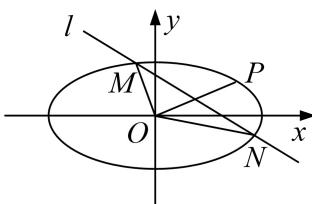

<!-- question-source:start -->
[例4] 已知椭圆 $C: \frac{x^2 + y^2}{a^2 + b^2} = 1 (a > b > 0)$ 的焦距为2，四个顶点构成的四边形面积为 $2\sqrt{2}$ .

(1)求椭圆 C 的标准方程;

(2)斜率存在的直线 l 与椭圆 C 相交于 M、N 两点，O 为坐标原点， $\overrightarrow{OP}=\overrightarrow{OM}+\overrightarrow{ON}$ ，若点 P 在椭圆上，请判断 $\triangle OMN$ 的面积是否为定值.

(2)设直线 l 方程是 $y=kx+m$ ，设 $M(x_{1}, y_{1})$ ， $N(x_{2}, y_{2})$ ， $P(x_{0}, y_{0})$ ，

联立 $\left\{ \begin{array}{l} y = kx + m, \\ \frac{x^2}{2} + y^2 = 1, \end{array} \right.$ 得 $(1 + 2k^2)x^2 + 4kmx + 2m^2 - 2 = 0,$

$$
\Delta = 8 \left(2 k ^ {2} - m ^ {2} + 1\right) > 0. x _ {1} + x _ {2} = \frac {- 4 k m}{1 + 2 k ^ {2}}, x _ {1} x _ {2} = \frac {2 \left(m ^ {2} - 1\right)}{1 + 2 k ^ {2}},
$$

$$
\vert M N \vert = \sqrt {1 + k ^ {2}} \cdot \left| x _ {1} - x _ {2} \right| = \sqrt {1 + k ^ {2}} \cdot \sqrt {\left(x _ {1} + x _ {2}\right) ^ {2} - 4 x _ {1} x _ {2}} = \sqrt {1 + k ^ {2}} \frac {\sqrt {8 (2 k ^ {2} + 1 - m ^ {2})}}{1 + 2 k ^ {2}}.
$$

又∵ $\overrightarrow{OP}=\overrightarrow{OM}+\overrightarrow{ON}$ ，所以 $\left\{\begin{aligned}x_{0}&=x_{1}+x_{2},\\ y_{0}&=y_{1}+y_{2},\end{aligned}\right.$ ∴ $P(\frac{-4km}{1+2k^{2}},\frac{2m}{1+2k^{2}})$

把点 P 坐标代入椭圆方程可得 $\left(\frac{-4km}{1+2k^{2}}\right)^{2}+2\left(\frac{2m}{1+2k^{2}}\right)=2$ ，整理可得 $4m^{2}=2k^{2}+1$ ，

又由点 $O$ 到直线 $y = kx + m$ 的距离 $d = \frac{|m|}{\sqrt{1 + k^2}}$ ， $\triangle OMN$ 的面积

$$
S _ {\triangle O M N} = \frac {1}{2} | M N | \cdot d = \frac {1}{2} \sqrt {1 + k ^ {2}} \frac {\sqrt {8 (2 k ^ {2} + 1 - m ^ {2})}}{1 + 2 k ^ {2}} \frac {| m |}{\sqrt {1 + k ^ {2}}} = \frac {\sqrt {2 (4 m ^ {2} - m ^ {2})}}{4 m ^ {2}} \times | m | = \frac {\sqrt {6}}{4}.
$$

所以， $\triangle OMN$ 的面积为定值 $\frac{\sqrt{6}}{4}$ .
<!-- question-source:end -->

![[高中/总复习/专题/圆锥曲线/专题20  面积型定值型问题-圆锥曲线/专题20_面积型定值型问题/例题选讲/例题/answers/Q00032567A1.md]]
