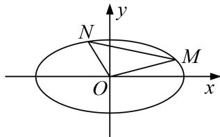

<!-- question-source:start -->
1. 已知椭圆 $\frac{x^2}{a^2} + \frac{y^2}{b^2} = 1 (a > b > 0)$ 的四个顶点围成的菱形的面积为 $4\sqrt{3}$ ，椭圆的一个焦点为 $(1, 0)$ .

(1)求椭圆的方程;

(2)若 $M, N$ 为椭圆上的两个动点，直线 $OM, ON$ 的斜率分别为 $k_{1}, k_{2}$ ，当 $k_{1}k_{2} = -\frac{3}{4}$ 时， $\triangle MON$ 的面积是否为定值？若为定值，求出此定值；若不为定值，说明理由.

<!-- question-source:end -->

![[高中/总复习/专题/圆锥曲线/专题20  面积型定值型问题-圆锥曲线/专题20_面积型定值型问题/对点训练/题目/answers/Q00032570A1.md]]
