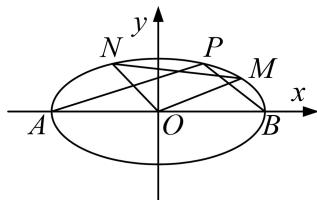

<!-- question-source:start -->
2. 已知椭圆 $C: \frac{x^2}{a^2} + \frac{y^2}{b^2} = 1 (a > b > 0)$ 的离心率为 $\frac{\sqrt{3}}{3}$ ，直线 $x - y + \sqrt{5} = 0$ 与椭圆 $C$ 有且只有一个公共点.

(1)求椭圆 $C$ 的标准方程

(2)设点 $A(-\sqrt{3}, 0)$ , $B(\sqrt{3}, 0)$ , $P$ 为椭圆 $C$ 上一点, 且直线 $PA$ , $PB$ 的斜率乘积为 $-\frac{2}{3}$ , 点 $M$ , $N$ 是椭

圆 C 上不同于 A, B 的两点，且满足 $AP \parallel OM$ , $BP \parallel ON$ ，求证： $\triangle OMN$ 的面积为定值.

<!-- question-source:end -->

![[高中/总复习/专题/圆锥曲线/专题20  面积型定值型问题-圆锥曲线/专题20_面积型定值型问题/对点训练/题目/answers/Q00032571A1.md]]
