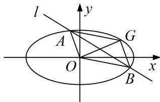

## 对点训练

![[高中/总复习/专题/圆锥曲线/专题20  面积型定值型问题-圆锥曲线/专题20_面积型定值型问题/对点训练_2/题目/Q00032576.md]]

## 题型三 四边形面积问题

[例 9] (2016·北京)已知椭圆 C: $\frac{x^{2}}{a^{2}}+\frac{y^{2}}{b^{2}}=1$ 过 A(2, 0), B(0, 1)两点.

(1)求椭圆 C 的方程及离心率;

(2)设 $P$ 为第三象限内一点且在椭圆 $C$ 上，直线 $PA$ 与 $y$ 轴交于点 $M$ ，直线 $PB$ 与 $x$ 轴交于点 $N$ 。求证：四边形ABNM的面积为定值.

[规范解答] (1)由题意得，a=2，b=1，所以椭圆 C 的方程为 $\frac{x^{2}}{4}+y^{2}=1$ .

又 $c = \sqrt{a^2 - b^2} = \sqrt{3}$ ，所以离心率 $e = \frac{c}{a} = \frac{\sqrt{3}}{2}$ .

(2)设 $P(x_0, y_0)(x_0 < 0, y_0 < 0)$ ，则 $x_0^2 + 4y_0^2 = 4$ 。又 $A(2, 0)$ ， $B(0, 1)$ ，

所以，直线 $PA$ 的方程为 $y = \frac{y_0}{x_0 - 2} (x - 2)$ 。令 $x = 0$ ，得 $y_M = -\frac{2y_0}{x_0 - 2}$ ，从而 $|BM| = 1 - y_M = 1 + \frac{2y_0}{x_0 - 2}$ 。

直线 $PB$ 的方程为 $y = \frac{y_0 - 1}{x_0} x + 1$ ，令 $y = 0$ ，得 $x_N = -\frac{x_0}{y_0 - 1}$ ，从而 $|AN| = 2 - x_N = 2 + \frac{x_0}{y_0 - 1}$ .

所以四边形 ABNM 的面积 $S=\frac{1}{2}|AN|\cdot|BM|=\frac{1}{2}(2+\frac{x_{0}}{y_{0}-1})(1+\frac{2y_{0}}{x_{0}-2})=\frac{x_{0}^{2}+4y_{0}^{2}+4x_{0}y_{0}-4x_{0}-8y_{0}+4}{2(x_{0}y_{0}-x_{0}-2y_{0}+2)}$

$= \frac{2x_0y_0 - 2x_0 - 4y_0 + 4}{x_0y_0 - x_0 - 2y_0 + 2} = 2.$ 从而四边形ABNM的面积为定值.

[例10] 已知椭圆 $C: \frac{x^2}{a^2} + \frac{y^2}{b^2} = 1 (a > b > 0)$ 的左、右焦点分别为 $F_1, F_2$ ，离心率为 $\frac{\sqrt{3}}{2}$ ，点 $G$ 是椭圆上一点， $\triangle GF_1F_2$ 的周长为 $6 + 4\sqrt{3}$ .

(1)求椭圆 C 的方程;

(2)直线 $l: y = kx + m$ 与椭圆 $C$ 交于 $A, B$ 两点，且四边形 $OAGB$ 为平行四边形，求证： $OAGB$ 的面积为定值.

[规范解答] (1)因为 $\triangle GF_{1}F_{2}$ 的周长为 $6 + 4\sqrt{3}$ ，所以 $2a + 2c = 6 + 4\sqrt{3}$ ，即 $a + c = 3 + 2\sqrt{3}$ . 又离心率 $e = \frac{c}{a} = \frac{\sqrt{3}}{2}$ ，解得 $a = 2\sqrt{3}$ ， $c = 3$ ， $b^{2} = 3$ 。∴椭圆 $C$ 的方程为 $\frac{x^2}{12} + \frac{y^2}{3} = 1$ 。

(2)设 $A(x_{1},y_{1})$ ， $B(x_{2},y_{2})$ ， $G(x_0,y_0)$ ，将 $y = kx + m$ 代入 $\frac{x^2}{12} +\frac{y^2}{3} = 1$

消去 y 并整理得 $(1+4k^{2})x^{2}+8kmx+4m^{2}-12=0$ ,

$$
x _ {1} + x _ {2} = \frac {8 k m}{1 + 4 k ^ {2}}, x _ {1} \cdot x _ {2} = \frac {4 m ^ {2} - 1 2}{1 + 4 k ^ {2}}, y _ {1} + y _ {2} = k (x _ {1} + x _ {2}) + 2 m = \frac {2 m}{1 + 2 k ^ {2}},
$$

∵四边形 OAGB 为平行四边形， $\overrightarrow{OG}=\overrightarrow{OA}+\overrightarrow{OB}=(x_{1}+x_{2},y_{1}+y_{2})$ ，得 $G(\frac{8km}{1+4k^{2}},\frac{2m}{1+2k^{2}})$ ,

将 G 点坐标代入椭圆 C 方程得 $m^{2}=\frac{3}{4}(1+4k^{2})$ ,

点 $O$ 到直线 $AB$ 的距离为 $d = \frac{|m|}{\sqrt{1 + k^2}}$ , $|AB| = \sqrt{1 + k^2} |x_1 - x_2|$ ,

∴平行四边形 OAGB 的面积为 $S=d\cdot|AB|=|m|\cdot|x_{1}-x_{2}|=|m|\cdot\sqrt{(x_{1}+x_{2})^{2}}-4x_{1}x_{2}$

$$
= 4 \frac {\left| m \right| \sqrt {3 - m ^ {2} + 1 2 k ^ {2}}}{1 + 4 k ^ {2}} = 4 \frac {\left| m \right| \sqrt {3 m ^ {2}}}{1 + 4 k ^ {2}} = 4 \sqrt {3} \frac {m ^ {2}}{1 + 4 k ^ {2}} = 3 \sqrt {3}.
$$

故平行四边形 OAGB 的面积为定值为 $3\sqrt{3}$ .
