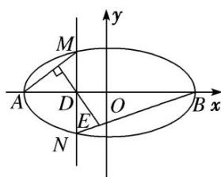

<!-- question-source:start -->
7. 已知椭圆 $C$ 的两个顶点分别为 $A(-2, 0)$ , $B(2, 0)$ , 焦点在 $x$ 轴上, 离心率为 $\frac{\sqrt{3}}{2}$ .

(1)求椭圆 C 的方程;

(2)如图所示, 点 $D$ 为 $x$ 轴上一点, 过点 $D$ 作 $x$ 轴的垂线交椭圆 $C$ 于不同的两点 $M, N$ , 过点 $D$ 作 $A M$ 的垂线交 $B N$ 于点 $E$ . 求证: $\triangle B D E$ 与 $\triangle B D N$ 的面积之比为定值, 并求出该定值.

<!-- question-source:end -->

![[高中/总复习/专题/圆锥曲线/专题20  面积型定值型问题-圆锥曲线/专题20_面积型定值型问题/对点训练_2/题目/answers/Q00032576A1.md]]
