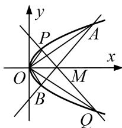

> [!faq]- 教师版对点训练解析
>
> > [!success]- **【答案】** 详见解析
>
> > [!note]- **【分析】**
> > 本题未单列分析。
>
> > [!note]- **【解析】**
> > 解析 (1)设椭圆 $C$ 的方程为 $\frac{x^2}{a^2} +\frac{y^2}{b^2} = 1(a > b > 0)$ ，由题意得 $\left\{ \begin{array}{l}a = 2,\\ c = \sqrt{3}\\ a = \frac{2}{2},\\ b^{2} + c^{2} = a^{2}, \end{array} \right.$ 解得 $\left\{ \begin{array}{l}b = 1,\\ c = \sqrt{3}, \end{array} \right.$ 所以椭圆 $C$ 的方程为 $\frac{x^2}{4} +y^2 = 1.$ (2)法一：设 $D(x_0,0),M(x_0,y_0),N(x_0, - y_0), - 2 <   x_0 <   2$ ，所以 $k_{AM} = \frac{y_0}{x_0 + 2}$ 因为 $AM\bot DE$ ，所以 $k_{DE} = -\frac{2 + x_0}{y_0}$ ，所以直线 $DE$ 的方程为 $y = -\frac{2 + x_0}{y_0}(x - x_0).$ 因为 $k_{BN} = -\frac{y_0}{x_0 - 2}$ ，所以直线 $BN$ 的方程为 $y = -\frac{y_0}{x_0 - 2}(x - 2).$ 由 $\left\{ \begin{array}{l}y = -\frac{2 + x_0}{y_0}(x - x_0)\\ y = -\frac{y_0}{x_0 - 2}(x - 2), \end{array} \right.$ 解得 $E\left(\frac{4}{5} x_0 + \frac{2}{5}, - \frac{4}{5} y_0\right),$ 所以 $\frac{S_{\triangle BDE}}{S_{\triangle BDN}} = \frac{\frac{1}{2}|BD|\cdot|y_E|}{\frac{1}{2}|BD|\cdot|y_N|} = \frac{|-\frac{4}{5}y_0|}{| - y_0|} = \frac{4}{5}.$ 故△BDE与△BDN的面积之比为定值 $\frac{4}{5}.$ 法二：设 $M(2\cos \theta ,\sin \theta)(\theta \neq k\pi ,k\in \mathbf{Z})$ ，则 $D(2\cos \theta ,0),N(2\cos \theta ,-\sin \theta)$ ，设 $\overrightarrow{BE} = \lambda \overrightarrow{BN}$ 则 $\overrightarrow{DE} = \overrightarrow{DB} +\overrightarrow{BE} = \overrightarrow{DB} +\lambda \overrightarrow{BN} = (2 - 2\cos \theta ,0) + \lambda (2\cos \theta -2, - \sin \theta)\\ = (2 - 2\cos \theta +2\lambda \cos \theta -2\lambda , - \lambda \sin \theta ).$ 又 $\overrightarrow{AM} = (2\cos \theta +2,\sin \theta)$ ，由 $\overrightarrow{AM}\bot \overrightarrow{DE}$ ，得 $\overrightarrow{AM}\cdot \overrightarrow{DE} = 0,$ 从而 $[(2 - 2\cos \theta ) + \lambda (2\cos \theta -2)](2\cos \theta +2) - \lambda \sin^2\theta = 0,$ 整理得 $4\sin^2\theta -4\lambda \sin^2\theta -\lambda \sin^2\theta = 0$ ，即 $5\lambda \sin^2\theta = 4\sin^2\theta .$ 所以 $\lambda = \frac{4}{5}$ ，所以 $\frac{S_{\triangle BDE}}{S_{\triangle BDN}} = \frac{|BE|}{|BN|} = \frac{4}{5}.$ 故△BDE与△BDN的面积之比为定值 $\frac{4}{5}.$ 8. 已知 $O$ 为坐标原点，过点 $M(1,0)$ 的直线 $l$ 与抛物线 $C:y^{2} = 2px(p > 0)$ 交于 $A,B$ 两点，且 $\overrightarrow{OA}\cdot \overrightarrow{OB} = -3.$ (1)求抛物线 $C$ 的方程；(2)过点 $M$ 作直线 $l^{\prime}\bot l$ 交抛物线 $C$ 于 $P,Q$ 两点，记△OAB，△OPQ的面积分别为 $S_{1},S_{2}$ ，证明： $\frac{1}{S_1^2}+$ $\frac{1}{S_2^2}$ 为定值.
> > 
> > 8. 解析 (1)设直线 $l: x = my + 1$ ，联立方程 $\left\{ \begin{array}{l} x = my + 1, \\ y^2 = 2px, \end{array} \right.$ 消去 $x$ 得， $y^2 - 2pmy - 2p = 0$
> > 设 $A(x_{1}, y_{1})$ ， $B(x_{2}, y_{2})$ ，则 $y_{1} + y_{2} = 2pm$ ， $y_{1}y_{2} = -2p$ ，
> > 又因为 $\overrightarrow{OA} \cdot \overrightarrow{OB} = x_1x_2 + y_1y_2 = (my_1 + 1)(my_2 + 1) + y_1y_2 = (1 + m^2)y_1y_2 + m(y_1 + y_2) + 1$
> > $$
> > = (1 + m ^ {2}) (- 2 p) + 2 p m ^ {2} + 1 = - 2 p + 1 = - 3.
> > $$
> > 解得 p=2 。所以抛物线 C 的方程为 $y^{2}=4x$
> > (2)由(1)知 $M(1, 0)$ 是抛物线 C 的焦点，
> > 所以 $|AB|=x_{1}+x_{2}+p=my_{1}+my_{2}+2+p=4m^{2}+4$ 。原点到直线l的距离 $d=\frac{1}{\sqrt{1+m^{2}}}$
> > 所以 $S_{1} = \frac{1}{2}\times \frac{1}{\sqrt{1 + m^{2}}}\times 4(m^{2} + 1) = 2\sqrt{1 + m^{2}}.$
> > 因为直线 $l'$ 过点 $(1, 0)$ 且 $l' \perp l$ ，所以 $S_{2} = 2\sqrt{1 + \left(\frac{1}{m}\right)^{2}} = 2\sqrt{\frac{1 + m^{2}}{m^{2}}}$ .
> > 所以 $\frac{1}{S_1^2} +\frac{1}{S_2^2} = \frac{1}{4(1 + m^2)} +\frac{m^2}{4(1 + m^2)} = \frac{1}{4}$ 即 $\frac{1}{S_1^2} +\frac{1}{S_2^2}$ 为定值 $\frac{1}{4}$
