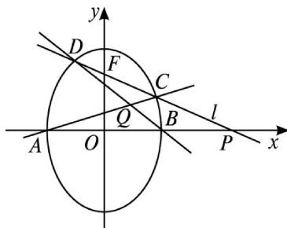

<!-- question-source:start -->
[例 3] 椭圆有两顶点 $A(-1, 0)$ ， $B(1, 0)$ ，过其焦点 $F(0, 1)$ 的直线 l 与椭圆交于 C，D 两点，并与 x 轴交于点 P．直线 AC 与直线 BD 交于点 Q.

(1)当 $|CD|=\frac{3\sqrt{2}}{2}$ 时，求直线l的方程；

(2)当点 P 异于 A, B 两点时，求证： $\overrightarrow{OP}\cdot\overrightarrow{OQ}$ 为定值.

[规范解答]
<!-- question-source:end -->

![[高中/总复习/专题/圆锥曲线/专题21  数量积、角度及参数型定值问题-圆锥曲线/专题21__数量积_角度及参数型定值问题/例题/answers/Q00042538A1.md]]
