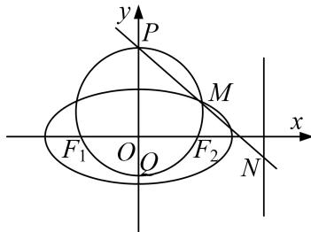

<!-- question-source:start -->
[例4] 如图，点 $M$ 在椭圆 $\frac{x^2}{2} +\frac{y^2}{b} = 1$ ， $(0 < b < \sqrt{2})$ 上，且位于第一象限， $F_{1}$ ， $F_{2}$ 为椭圆的两个焦点，过 $F_{1}$ ， $F_{2}$ ， $M$ 的圆与 $y$ 轴交于点 $P$ ， $Q(P$ 在 $Q$ 的上方)， $|OP|\cdot |OQ| = 1$

(1)求 b 的值;

(2)直线 $PM$ 与直线 $x = 2$ 交于点 $N$ ，试问，在 $x$ 轴上是否存在定点 $T$ ，使得 $\overrightarrow{TM}\cdot \overrightarrow{TN}$ 为定值？若存在，求

出点 T 的坐标与该定值；若不存在，请说明理由.

[规范解答]
<!-- question-source:end -->

![[高中/总复习/专题/圆锥曲线/专题21  数量积、角度及参数型定值问题-圆锥曲线/专题21__数量积_角度及参数型定值问题/例题/answers/Q00042539A1.md]]
