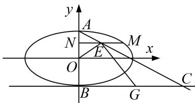

<!-- question-source:start -->
[例1] 已知椭圆 $W: \frac{x^2}{a^2} + \frac{y^2}{b^2} = 1 (a > b > 0)$ 的上下顶点分别为 $A, B$ ，且点 $B(0, -1)$ . $F_1, F_2$ 分别为椭圆 $W$ 的左、右焦点，且 $\angle F_1BF_2 = 120^\circ$ .

(1)求椭圆 W 的标准方程;

(2)点 $M$ 是椭圆上异于 $A, B$ 的任意一点，过点 $M$ 作 $MN \perp y$ 轴于 $N, E$ 为线段 $MN$ 的中点．直线 $AE$ 与直线 $y = -1$ 交于点 $C, G$ 为线段 $BC$ 的中点， $O$ 为坐标原点．求证： $\angle OEG$ 为定值.

  
(1) 图

  
(2) 图

[规范解答]
(1)依题意，得 b=1。又 $\angle F_{1}BF_{2}=120^{\circ}$ ，在 Rt△ $BF_{1}O$ 中， $\angle F_{1}BO=60^{\circ}$ ，所以 a=2。所以椭圆 W 的标准方程为 $\frac{x^{2}}{4}+y^{2}=1$ 。

(2)设 $M(x_{0}, y_{0})$ ， $x_{0} \neq 0$ ，则 $N(0, y_{0})$ ， $E(\frac{x_{0}}{2}, y_{0})$ .

因为点 M 在椭圆 W 上，所以 $\frac{x_{0}^{2}}{4} + y_{0}^{2} = 1$ 。即 $x_{0}^{2} = 4 - 4y_{0}^{2}$

又 $A(0, 1)$ ，所以直线 $AE$ 的方程为 $y - 1 = \frac{2(y_0 - 1)}{x_0} x$ 。令 $y = -1$ ，得 $C(\frac{x_0}{1 - y_0}, -1)$ 。

又 $B(0, -1)$ , $G$ 为线段 $BC$ 的中点, 所以 $G(\frac{x_0}{2(1 - y_0)}, -1)$ .

所以 $\overrightarrow{OE} = (\frac{x_0}{2}, y_0)$ , $\overrightarrow{GE} = (\frac{x_0}{2} - \frac{x_0}{2(1 - y_0)}, y_0 + 1)$ .

$$
\overrightarrow {O E} \cdot \overrightarrow {G E} = \frac {x _ {0}}{2} \left(\frac {x _ {0}}{2} - \frac {x _ {0}}{2 (1 - y _ {0})}\right) + y _ {0} \left(y _ {0} + 1\right) = \frac {x _ {0} ^ {2}}{4} - \frac {x _ {0} ^ {2}}{4 (1 - y _ {0})} + y _ {0} ^ {2} + y _ {0}
$$

$= 1 - \frac{4 - 4y_0^2}{4(1 - y_0)} + y_0 = 1 - y_0 - 1 + y_0 = 0$ ，所以 $\overrightarrow{OE} \perp \overrightarrow{GE}$ . $\angle OEG = 90^{\circ}$
<!-- question-source:end -->
