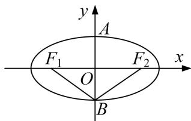

<!-- question-source:start -->
[例1] 已知椭圆 $W: \frac{x^2}{a^2} + \frac{y^2}{b^2} = 1 (a > b > 0)$ 的上下顶点分别为 $A, B$ ，且点 $B(0, -1)$ . $F_1, F_2$ 分别为椭圆 $W$ 的左、右焦点，且 $\angle F_1BF_2 = 120^\circ$ .

(1)求椭圆 W 的标准方程;

(2)点 $M$ 是椭圆上异于 $A, B$ 的任意一点，过点 $M$ 作 $MN \perp y$ 轴于 $N, E$ 为线段 $MN$ 的中点．直线 $AE$ 与直线 $y = -1$ 交于点 $C, G$ 为线段 $BC$ 的中点， $O$ 为坐标原点．求证： $\angle OEG$ 为定值.

<!-- question-source:end -->

![[高中/总复习/专题/圆锥曲线/专题21  数量积、角度及参数型定值问题-圆锥曲线/专题21__数量积_角度及参数型定值问题/例题/answers/Q00042546A1.md]]
