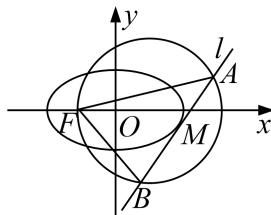

<!-- question-source:start -->
[例2] 已知点 $M(x_0, y_0)$ 为椭圆 $C: \frac{x^2}{2} + y^2 = 1$ 。上任意一点，直线 $l: x_0x + 2y_0y = 2$ 与圆 $(x - 1)^2 + y^2 = 6$ 交于 $A, B$ 两点，点 $F$ 为椭圆 $C$ 的左焦点。

(1)求椭圆 C 的离心率及左焦点 F 的坐标;

(2)求证：直线 $l$ 与椭圆 $C$ 相切；

(3)判断 $\angle AFB$ 是否为定值，并说明理由.

[规范解答]
(1)由题意 $a = \sqrt{2}$ , $b = 1$ , $c = 1$ . 所以离心率 $\mathrm{e} = \frac{c}{a} = \frac{\sqrt{2}}{2}$ , 左焦点 $F(-1, 0)$ .

(2)由题知， $\frac{x_{0}^{2}}{2}+y_{0}^{2}=1$ ，即 $x_{0}^{2}+2y_{0}^{2}=2$ ，

当 $y_0 = 0$ 时直线 $l$ 的方程为 $x = \sqrt{2}$ 或 $x = -\sqrt{2}$ ，直线 $l$ 与椭圆 $C$ 相切.

当 $y_{0} \neq 0$ 时，由 $\left\{\begin{aligned}\frac{x^{2}}{2} + y^{2} &= 1, \\ x_{0}x + 2y_{0} & y = 2,\end{aligned}\right.$ 得 $(2y_{0}^{2} + x_{0}^{2})x^{2} - 4x_{0}x + 4 - 4y_{0}^{2} = 0$ ，即 $x^{2} - 2x_{0}x + 2 - 2y_{0}^{2} = 0$ .

所以 $\Delta=(-2x_{0})^{2}-4(2-2y_{0}^{2})=4x_{0}^{2}+8y_{0}^{2}-8=0$ 。故直线l与椭圆C相切。

(3)设 $A(x_{1}, y_{1})$ , $B(x_{2}, y_{2})$ ,

当 $y_{0}=0$ 时， $x_{1}=x_{2}$ ， $y_{1}=-y_{2}$ ， $x_{1}=\pm\sqrt{2}$ ，

$\overrightarrow{FA}\cdot\overrightarrow{FB}=(x_{1}+1)^{2}-y_{2}^{2}=(x_{1}+1)^{2}-6+(x_{1}-1)^{2}=2x_{1}^{2}-4=0$ ，所以 $\overrightarrow{FA}\perp\overrightarrow{FB}$ ，即 $\angle AFB=90^{\circ}$

当 $y_{0} \neq 0$ 时，由 $\left\{\begin{aligned}(x-1)^{2}+y^{2}&=6,\\ x_{0}x+2y_{0}y&=2,\end{aligned}\right.$ 得 $(y_{0}^{2}+1)x^{2}-2(2y_{0}^{2}+x_{0})x+2-10y_{0}^{2}=0,$

$$
\therefore x _ {1} + x _ {2} = \frac {2 \left(2 y _ {0} ^ {2} + x _ {0}\right)}{1 + y _ {0} ^ {2}}, x _ {1} x _ {2} = \frac {2 - 1 0 y _ {0} ^ {2}}{1 + y _ {0} ^ {2}}. y _ {1} y _ {2} = \frac {x _ {0} {} ^ {2}}{4 y _ {0} {} ^ {2}} x _ {1} x _ {2} - \frac {x _ {0}}{2 y _ {0} {} ^ {2}} \left(x _ {1} + x _ {2}\right) + \frac {1}{y _ {0} {} ^ {2}} = \frac {- 5 x _ {0} {} ^ {2} - 4 x _ {0} + 4}{2 + 2 y _ {0} {} ^ {2}}.
$$

$$
\overrightarrow {F A} \cdot \overrightarrow {F B} = (x _ {1} + 1, y _ {1}) \cdot (x _ {2} + 1, y _ {2}) = x _ {1} x _ {2} + x _ {1} + x _ {2} + 1 + y _ {1} y _ {2}
$$

$$
= \frac {4 - 2 0 y _ {0} ^ {2} + 8 y _ {0} ^ {2} + 4 x _ {0} + 2 + 2 y _ {0} ^ {2}}{2 + 2 y _ {0} ^ {2}} + \frac {- 5 x _ {0} ^ {2} - 4 x _ {0} + 4}{2 + 2 y _ {0} ^ {2}} = \frac {- 5 \left(x _ {0} ^ {2} + 2 y _ {0} ^ {2}\right) + 1 0}{2 + 2 y _ {0} ^ {2}} = 0.
$$

所以 $\overrightarrow{FA}\perp\overrightarrow{FB}$ ，即 $\angle AFB=90^{\circ}$ 。故 $\angle AFB$ 为定值 $90^{\circ}$ 。
<!-- question-source:end -->
