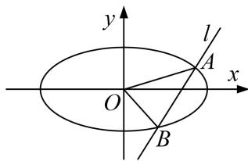

<!-- question-source:start -->
[例 3] 已知点 $F_{1}$ 为椭圆 $\frac{x^{2}}{a^{2}} + \frac{y^{2}}{b^{2}} = 1 (a > b > 0)$ 的左焦点， $P(-1, \frac{\sqrt{2}}{2})$ 在椭圆上， $PF_{1} \perp x$ 轴.

(1)求椭圆的方程:

(2)已知直线 l 与椭圆交于 A, B 两点，且坐标原点 O 到直线 l 的距离为 $\frac{\sqrt{6}}{3}$ ， $\angle AOB$ 的大小是否为定值？若是，求出该定值：若不是，请说明理由.

[规范解答]
<!-- question-source:end -->

![[高中/总复习/专题/圆锥曲线/专题21  数量积、角度及参数型定值问题-圆锥曲线/专题21__数量积_角度及参数型定值问题/例题/answers/Q00042548A1.md]]
