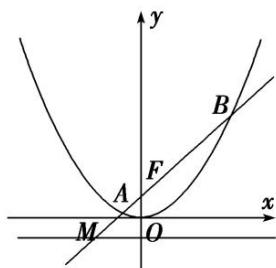

<!-- question-source:start -->
[例 3] 如图，过抛物线 C: $x^{2}=2py(p>0)$ 的焦点 F 的直线 l 与抛物线 C 相交于 A, B 两点，交准线于点 M. 当 $|AB|=12$ 时，AB 的中点到 x 轴的距离是 5.

(1)求抛物线 C 的方程;

(2)已知 $\overrightarrow{MA} = \lambda_1\overrightarrow{AF}$ ， $\overrightarrow{MB} = \lambda_2\overrightarrow{BF}$ ，求 $\lambda_{1} + \lambda_{2}$ 的值.

[规范解答]
<!-- question-source:end -->

![[高中/总复习/专题/圆锥曲线/专题21  数量积、角度及参数型定值问题-圆锥曲线/专题21__数量积_角度及参数型定值问题/例题/answers/Q00042554A1.md]]
