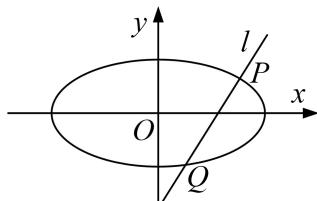

<!-- question-source:start -->
2. 已知椭圆 $\frac{x^2}{a^2} + \frac{y^2}{b^2} = 1 (a > b > 0)$ 的一个焦点与抛物线 $y^2 = 4\sqrt{3} x$ 的焦点 $F$ 重合，且椭圆短轴的两个端点与点 $F$ 构成正三角形.

(1)求椭圆的方程;

(2)若过点(1, 0)的直线 l 与椭圆交于不同的两点 P, Q，试问在 x 轴上是否存在定点 $E(m, 0)$ ，使 $\overrightarrow{PE} \cdot \overrightarrow{QE}$ 恒为定值？若存在，求出 E 的坐标，并求出这个定值；若不存在，请说明理由.

<!-- question-source:end -->

![[高中/总复习/专题/圆锥曲线/专题21  数量积、角度及参数型定值问题-圆锥曲线/专题21__数量积_角度及参数型定值问题/对点训练/answers/Q00042542A1.md]]
