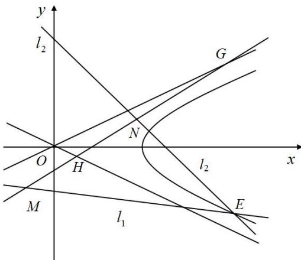

> [!faq]- 《专题21  数量积、角度及参数型定值问题-圆锥曲线》例题解析
>
> > [!success]- **【答案】** 详见解析
>
> > [!note]- **【分析】**
> > 本题未单列分析。
>
> > [!note]- **【解析】**
> > (1)求双曲线 C 的标准方程及其渐近线方程;
> >
> > (2)如图，已知过点 $M(x_{1},y_{1})$ 的直线 $l_{1}:x_{1}x + 4y_{1}y = 4$ 与过点 $N(x_{2},y_{2})($ 其中 $x_{2}\neq x_{1})$ 的直线 $l_{2}:x_{2}x + 4y_{2}y$
> >
> > =4 的交点 E 在双曲线 C 上，直线 MN 与两条渐近线分别交于 G，H 两点，求 $\overrightarrow{OG}\cdot\overrightarrow{OH}$ 的值.
> >
> > 
> >
> > 5. 解析
> > (1) 设 $C$ 的标准方程是 $\frac{x^2}{a^2} - \frac{y^2}{b^2} = 1 (a > 0, b > 0)$ ，则由题意 $c = \sqrt{5}$ ， $e = \frac{c}{a} = \frac{\sqrt{5}}{2}$ .
> >
> > 因此， $C$ 的标准方程为 $\frac{x^2}{4} - y^2 = 1$ 。 $C$ 的渐近线方程为 $y = \pm \frac{1}{2} x$ ，即 $x - 2y = 0$ 和 $x + 2y = 0$ .
> >
> > (2)如图，由题意点 $E(x_0, y_0)$ 在直线 $l_1: x_1x + 4y_1y = 4$ 和 $l_2: x_2x + 4y_2y = 4$ 上，
> >
> > 因此有 $x_{1}x_{0} + 4y_{1}y_{0} = 4$ ， $x_{2}x_{0} + 4y_{2}y_{0} = 4$ 。故点 $M$ 、 $N$ 均在直线 $x_0x + 4y_0y = 4$ 上，
> >
> > 因此直线 MN 的方程为 $x_{0}x + 4y_{0}y = 4$ .
> >
> > 设 G、H 分别是直线 MN 与渐近线 x-2y=0 及 $x+2y=0$ 的交点，
> >
> > 由方程组 $\left\{\begin{aligned}x_{0}x+4y_{0}y=4\\ x-2y=0\end{aligned}\right.$ 及 $\left\{\begin{aligned}x_{0}x+4y_{0}y=4\\ x+2y=0\end{aligned}\right.$ ，解得 $\left\{\begin{aligned}x_{G}&=\frac{4}{x_{0}+2y_{0}}\\ y_{G}&=\frac{2}{x_{0}+2y_{0}}\end{aligned}\right.$ ， $\left\{\begin{aligned}x_{H}&=\frac{4}{x_{0}-2y_{0}}\\ y_{H}&=\frac{-2}{x_{0}-2y_{0}}\end{aligned}\right.$
> >
> > $$
> > \overrightarrow {O G} \cdot \overrightarrow {O H} = \frac {4}{x _ {0} + 2 y _ {0}} \cdot \frac {4}{x _ {0} - 2 y _ {0}} - \frac {2}{x _ {0} + 2 y _ {0}} \cdot \frac {2}{x _ {0} - 2 y _ {0}} = \frac {1 2}{x _ {0} ^ {2} - 4 y _ {0} ^ {2}}.
> > $$
> >
> > 因为点 E 在双曲线 $\frac{x^{2}}{4}-y^{2}=1$ 上，所以 $x_{0}^{2}-4y_{0}^{2}=4$ ，所以 $\overrightarrow{OG}\cdot\overrightarrow{OH}=\frac{12}{x_{0}^{2}-4y_{0}^{2}}=3$ .
> >
> > ## 题型二 角度型定值问题
> >
> > 【例题选讲】
