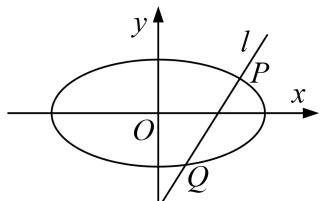

> [!faq]- 《专题21  数量积、角度及参数型定值问题(教师版)》例题解析
>
> > [!success]- **【答案】** 详见解析
>
> > [!note]- **【解析】**
> > (1)求椭圆 E 的方程;
> >
> > (2)过点(1, 0)作直线 l 交 E 于 P、Q 两点，试问：在 x 轴上是否存在一个定点 M，使 $\overrightarrow{MP} \cdot \overrightarrow{MQ}$ 为定值？若存在，求出这个定点 M 的坐标；若不存在，请说明理由.
> >
> > 
> >
> > 1.
> > (1)设椭圆 E 的方程为 $\frac{x^{2}}{a^{2}} + \frac{y^{2}}{b^{2}} = 1 (a > b > 0)$ ,
> >
> > 由已知得 $\left\{\begin{aligned}a-c&=\sqrt{2}-1,\\ \frac{c}{a}&=\frac{\sqrt{2}}{2},\end{aligned}\right.$ 解得， $\left\{\begin{aligned}a&=\sqrt{2},\\ c&=1,\end{aligned}\right.$ 所以 $b^{2}=1$ .
> >
> > 所以椭圆 E 的方程为 $\frac{x^{2}}{2} + y^{2} = 1$ .
> >
> > (2)假设存在符合条件的点 $M(m, 0)$ ，设 $A(x_{1}, y_{1})$ ， $B(x_{2}, y_{2})$ ，
> >
> > 则 $\overrightarrow{MP}=(x_{1}-m,\ y_{1}),\ \overrightarrow{MQ}=(x_{2}-m,\ y_{2})$ ,
> >
> > $$
> > \overrightarrow {M P} \cdot \overrightarrow {M Q} = (x _ {1} - m) (x _ {2} - m) + y _ {1} y _ {2} = x _ {1} x _ {2} - m (x _ {1} + x _ {2}) + m ^ {2} + y _ {1} y _ {2},
> > $$
> > - **①**：当直线 l 的斜率存在时，设直线 l 的方程为 $y=k(x-1)$ ,
> >
> > 联立椭圆方程 $\frac{x^{2}}{2}+y^{2}=1$ ，化为 $(1+2k^{2})x^{2}-4k^{2}x+2k^{2}-2=0$ ，
> >
> > $$
> > x _ {1} + x _ {2} = \frac {4 k ^ {2}}{2 k ^ {2} + 1}, x _ {1} x _ {2} = \frac {2 k ^ {2} - 2}{2 k ^ {2} + 1}. \therefore y _ {1} y _ {2} = k ^ {2} [ - (x _ {1} + x _ {2}) + x _ {1} x _ {2} + 1 ] = - \frac {k ^ {2}}{2 k ^ {2} + 1},
> > $$
> >
> > $$
> > \overrightarrow {M P} \cdot \overrightarrow {M Q} = \frac {k ^ {2} (2 m ^ {2} - 4 m + 1) + m ^ {2} - 2}{2 k ^ {2} + 1}.
> > $$
> >
> > 对于任意的 $k$ 值，上式为定值，故 $2m^{2} - 4m + 1 = 2(m^{2} - 2)$ ，解得， $m = \frac{5}{4}$
> >
> > 此时， $\overrightarrow{MP}\cdot\overrightarrow{MQ}=m^{2}-2=-\frac{7}{16}$ 为定值；
> > - **②**：当直线 l 的斜率不存在时，
> >
> > 直线 l: x=1, $x_{1}x_{2}=1$ , $x_{1}+x_{2}=2$ , $y_{1}y_{2}=-\frac{1}{2}$ ,
> >
> > 由， $m=\frac{5}{4}$ ，得 $\overrightarrow{MP}\cdot\overrightarrow{MQ}=1-2\times\frac{5}{4}+\frac{25}{16}-\frac{1}{2}=-\frac{7}{16}$ 为定值，
> >
> > 综合①②知，符合条件的点 M 存在，其坐标为 $\left(\frac{5}{4}, 0\right)$ .
