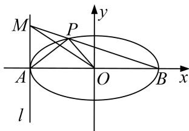

> [!faq]- 《专题21  数量积、角度及参数型定值问题(教师版)》例题解析
>
> > [!success]- **【答案】** 详见解析
>
> > [!note]- **【解析】**
> > (1)求椭圆 $C$ 的方程;
> >
> > (2)求证： $AP\bot OM$
> >
> > (3)试问 $\overrightarrow{OP}\cdot\overrightarrow{OM}$ 是否为定值？若是定值，请求出该定值；若不是定值，请说明理由.
> >
> > 
> >
> > 3. 解析
> > (1)∵椭圆 C: $\frac{x^{2}}{a^{2}}+\frac{y^{2}}{b^{2}}=1(a>b>0)$ 的离心率为 $\frac{\sqrt{2}}{2}$ ,
> >
> > $\therefore a^{2} = 2c^{2}$ ，则 $a^2 = 2b^2$ ，又椭圆 $C$ 过点 $(1, \frac{\sqrt{6}}{2})$ ， $\therefore \frac{1}{a^2} + \frac{3}{2b^2} = 1$ ： $\therefore a^2 = 4$ ， $b^2 = 2$
> >
> > 则椭圆 C 的方程 $\frac{x^{2}}{4} + \frac{y^{2}}{2} = 1$ .
> >
> > (2)设直线 BM 的斜率为 k，则直线 BM 的方程为 $y=k(x-2)$ ，设 $P(x_{1}, y_{1})$ ,
> >
> > 将 $y = k(x - 2)$ 代入椭圆C的方程 $\frac{x^2}{4} +\frac{y^2}{2} = 1$ 中并化简得： $(2k^{2} + 1)x^{2} - 4k^{2}x + 8k^{2} - 4 = 0.$
> >
> > 解之得 $x_{1} = \frac{4k^{2} - 2}{2k^{2} + 1}, x_{2} = 2,$
> >
> > $\therefore y_{1} = k(x_{1} - 2) = \frac{-4k}{2k^{2} + 1}$ ，从而 $P(\frac{4k^2 - 2}{2k^2 + 1},\frac{-4k}{2k^2 + 1}).$
> >
> > 在 $y=k(x-2)$ 上，令 x=-2，得 y=-4k，∴ $M(-2, -4k)$ .
> >
> > $$
> > \overrightarrow {A P} = \left(\frac {4 k ^ {2} - 2}{2 k ^ {2} + 1} + 2, \frac {- 4 k}{2 k ^ {2} + 1}\right) = \left(\frac {8 k ^ {2}}{2 k ^ {2} + 1}, \frac {- 4 k}{2 k ^ {2} + 1}\right),
> > $$
> >
> > $$
> > \therefore \overrightarrow {A P} \cdot \overrightarrow {O M} = \frac {- 1 6 k ^ {2}}{2 k ^ {2} + 1} + \frac {1 6 k ^ {2}}{2 k ^ {2} + 1} = 0, \therefore A P \perp O M;
> > $$
> >
> > $$
> > (3) \overrightarrow {O P} \cdot \overrightarrow {O M} = (\frac {4 k ^ {2} - 2}{2 k ^ {2} + 1}, \frac {- 4 k}{2 k ^ {2} + 1}) \cdot (- 2, - 4 k) = \frac {- 8 k ^ {2} + 4 + 1 6 k ^ {2}}{2 k ^ {2} + 1} = \frac {8 k ^ {2} + 4}{2 k ^ {2} + 1} = 4.
> > $$
> >
> > $\therefore \overrightarrow{OP} \cdot \overrightarrow{OM}$ 为定值4.
