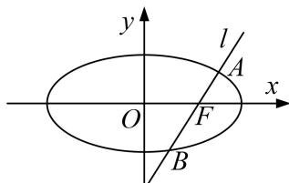

<!-- question-source:start -->
[例1] 已知椭圆 $\frac{x^2}{a^2} + \frac{y^2}{b^2} = 1 (a > b > 0)$ 的离心率为 $\frac{\sqrt{2}}{2}$ ，右焦点为 $F(1, 0)$ ，直线 $l$ 经过点 $F$ ，且与椭圆交于 $A$ ， $B$ 两点， $O$ 为坐标原点.

(1)求椭圆的标准方程;

(2)当直线 l 绕点 F 转动时，试问：在 x 轴上是否存在定点 M，使得 $\overrightarrow{MA} \cdot \overrightarrow{MB}$ 为常数? 若存在，求出定点 M 的坐标；若不存在，请说明理由.

(2)若直线不 l 垂直于 x 轴，可设 l 的方程为 $y=k(x-1)$ .

联立椭圆方程 $\frac{x^{2}}{2}+y^{2}=1$ ，化为 $(1+2k^{2})x^{2}-4k^{2}x+2k^{2}-2=0$ ，

设 $A(x_{1}, y_{1})$ ， $B(x_{2}, y_{2})$ ，则 $x_{1} + x_{2} = \frac{4k^{2}}{2k^{2} + 1}$ ， $x_{1}x_{2} = \frac{2k^{2} - 2}{2k^{2} + 1}$ .

设 $M(t, 0)$ ，则 $\overrightarrow{MA} = (x_{1} - t, y_{1})$ ， $\overrightarrow{MB} = (x_{2} - t, y_{2})$ ，

$\overrightarrow{MA} \cdot \overrightarrow{MB} = (x_{1} - t, y_{1})(x_{2} - t, y_{2}) = (x_{1} - t)(x_{2} - t) + y_{1}y_{2} = (x_{1} - t)(x_{2} - t) + k^{2}(x_{1} - 1)(x_{2} - 1)$ $= (1 + k^{2})x_{1}x_{2} - (t + k^{2})(x_{1} + x_{2}) + t^{2} + k^{2} = (1 + k^{2})\frac{2k^{2} - 2}{2k^{2} + 1} -(t + k^{2})\frac{4k^{2}}{2k^{2} + 1} +t^{2} + k^{2}$ $= \frac{k^2(2t^2 - 4t + 1) + t^2 - 2}{2k^2 + 1}.$

要使得 $\overrightarrow{MA}\cdot\overrightarrow{MB}=\lambda(\lambda$ 为常数)，只要 $\frac{k^{2}(2t^{2}-4t+1)+t^{2}-2}{2k^{2}+1}=\lambda,$

即 $(2t^{2}-4t+1-2\lambda)k^{2}+(t^{2}-2-\lambda)=0.$

对于任意实数 k，要使上式恒成立，只要 $\left\{\begin{aligned}&2t^{2}-4t+1-2\lambda=0,\\ &t^{2}-2-\lambda=0\end{aligned}\right.$ ，解得 $\left\{\begin{aligned}&t=\frac{5}{4},\\ &\lambda=-\frac{7}{16}\end{aligned}\right.$

若直线 l 垂直于 x 轴，其方程为 x=1，此时，直线 l 与椭圆两交点为 $A(1, \frac{\sqrt{2}}{2})$ ， $B(1, -\frac{\sqrt{2}}{2})$ ，

取点 $M(\frac{5}{4}, 0)$ ，有 $\overrightarrow{MA} = (-\frac{1}{4}, \frac{\sqrt{2}}{2})$ ， $\overrightarrow{MB} = (-\frac{1}{4}, -\frac{\sqrt{2}}{2})$

$$
\overrightarrow {M A} \cdot \overrightarrow {M B} = (- \frac {1}{4}) (- \frac {1}{4}) + \frac {\sqrt {2}}{2} (- \frac {\sqrt {2}}{2}) = - \frac {7}{1 6} = \lambda .
$$

综上所述，过定点 $F(1,0)$ 的动直线 $l$ 与椭圆相交于 $A$ ， $B$ 两点，当直线 $l$ 绕点 $F$ 转动时，存在定点 $M(\frac{5}{4},0)$ ，使得 $\overrightarrow{MA}\cdot \overrightarrow{MB} = -\frac{7}{16}.$
<!-- question-source:end -->

![[高中/总复习/专题/圆锥曲线/专题21  数量积、角度及参数型定值问题-圆锥曲线/专题21_数量积_角度及参数型定值问题/题型一_数量积型定值问题/例题选讲/例题/answers/Q00032800A1.md]]
