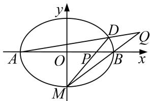

<!-- question-source:start -->
[例2] 已知 $O$ 为坐标原点，椭圆 $C: \frac{x^2}{4} + y^2 = 1$ 上一点 $E$ 在第一象限，若 $|OE| = \frac{\sqrt{7}}{2}$ .

(1)求点 E 的坐标；

(2)椭圆 C 两个顶点分别为 $A(-2,0)$ ， $B(2,0)$ ，过点 $M(0,-1)$ 的直线 l 交椭圆 C 于点 D，交 x 轴于点 P，若直线 AD 与直线 MB 相交于点 Q，求证： $\overrightarrow{OP}\cdot\overrightarrow{OQ}$ 为定值.

(2)设点 $D(x_{1},y_{1})$ ，则直线 $DA$ 的方程为 $y = \frac{y_1}{x_1 + 2} (x + 2)$ ③，直线 $BM$ 的方程为 $y = \frac{1}{2} x - 1$ ④，

由③④解得 $x_{Q}=\frac{2(x_{1}+2y_{1}+2)}{x_{1}-2y_{1}+2}$ ，又直线 DM 的方程为 $y=\frac{y_{1}+1}{x_{1}}x-1$ ，

令 y=0，解得 $x_{P}=\frac{x_{1}}{y_{1}+2}$ ，所以 $\overrightarrow{OP}\cdot\overrightarrow{OQ}=\frac{2(x_{1}+2y_{1}+2)}{x_{1}-2y_{1}+2}\cdot\frac{x_{1}}{y_{1}+2}=\frac{2(x_{1}^{2}+2x_{1}y_{1}+2x_{1})}{x_{1}y_{1}+x_{1}-2y_{1}^{2}+2}$

又 $\frac{x_1^2}{4} + y_1^2 = 1$ ，所以 $\overrightarrow{OP} \cdot \overrightarrow{OQ} = \frac{2(x_1^2 + 2x_1y_1 + 2x_1)}{x_1y_1 + x_1 + \frac{x_1^2}{2}} = 4.$
<!-- question-source:end -->

![[高中/总复习/专题/圆锥曲线/专题21  数量积、角度及参数型定值问题-圆锥曲线/专题21_数量积_角度及参数型定值问题/题型一_数量积型定值问题/例题选讲/例题/answers/Q00032801A1.md]]
