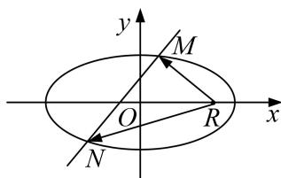

<!-- question-source:start -->
[例5] 已知椭圆 $C: \frac{x^2}{a^2} + \frac{y^2}{b^2} = 1 (a > b > 0)$ 的离心率为 $\frac{\sqrt{2}}{2}$ ，过右焦点且垂直于 $x$ 轴的直线 $l_1$ 与椭圆 $C$ 交于

A，B两点，且 $|AB|=\sqrt{2}$ ，直线 $l_{1}:y=k(x-m)(m\in\mathbf{R},m>\frac{3}{4})$ 与椭圆C交于M，N两点.

(1)求椭圆 C 的标准方程;

(2)已知点 $R(\frac{5}{4}, 0)$ ，若 $\overrightarrow{RM} \cdot \overrightarrow{RN}$ 是一个与 $k$ 无关的常数，求实数 $m$ 的值.

(2)设 $M(x_{1}, y_{1})$ , $N(x_{2}, y_{2})$ ，联立方程 $\left\{\begin{aligned}\frac{x^{2}}{2}+y^{2}&=1,\\ y=k(x-m),\end{aligned}\right.$ 消元得 $(1+2k^{2})x^{2}-4mk^{2}x+2m^{2}k^{2}-2=0$ , $\Delta=16m^{2}k^{4}-4(1+2k^{2})(2k^{2}m^{2}-2)=8(2k^{2}-k^{2}m^{2}+1)$ , $\therefore x_{1}+x_{2}=\frac{4mk^{2}}{2k^{2}+1}$ , $x_{1}x_{2}=\frac{2m^{2}k^{2}-2}{2k^{2}+1}$ . $\overrightarrow{RM}\cdot\overrightarrow{RN}=(x_{1}-\frac{5}{4})(x_{2}-\frac{5}{4})+y_{1}y_{2}=x_{1}x_{2}-\frac{5}{4}(x_{1}+x_{2})+\frac{25}{16}+k^{2}(x_{1}-m)(x_{2}-m)$ $=(1+k^{2})x_{1}x_{2}-(\frac{5}{4}+mk^{2})(x_{1}+x_{2})+\frac{25}{16}+k^{2}m^{2}=\frac{(3m^{2}-5m-2)k^{2}-2}{2k^{2}+1}+\frac{25}{16},$

(这里的计算使用点乘双根法更便捷)

令 $(1 + 2k^{2})x^{2} - 4mk^{2}x + 2k^{2}m^{2} - 2 = (1 + 2k^{2})(x_{1} - x)(x_{2} - x),$

再令 $x=\frac{5}{4}$ ，得 $(x_{1}-\frac{5}{4})(x_{2}-\frac{5}{4})=\frac{\frac{25}{16}(1+2k^{2})-5mk^{2}+3k^{2}m^{2}-2}{2k^{2}+1}$ ,

$\because y_{1}y_{2}=k^{2}(x_{1}-m)(x_{2}-m),\quad\therefore$ 再令 x=m，得 $k^{2}(x_{1}-m)(x_{2}-m)=\frac{m^{2}k^{2}-2k^{2}}{2k^{2}+1},$

$$
\therefore \left(x _ {1} - \frac {5}{4}\right) \left(x _ {2} - \frac {5}{4}\right) + y _ {1} y _ {2} = \frac {(3 m ^ {2} - 5 m - 2) k ^ {2} - 2}{2 k ^ {2} + 1} + \frac {2 5}{1 6}
$$

(选择自己熟练的计算方法进行计算，务必保证计算不能出错)

又 $\overrightarrow{RM}\cdot\overrightarrow{RN}$ 是一个与k无关的常数，∴ $3m^{2}-5m-2=-4$ ，即 $3m^{2}-5m+2=0$ ，

∴ m=1 或 $m=\frac{2}{3}$ ，又∵ $m>\frac{3}{4}$ ，∴ m=1，

当 m=1 时， $\Delta>0$ ，直线 $l_{1}$ 与椭圆 C 交于两点，满足题意， $\therefore m=1$ .

[题后悟通] 本题的关键点就在于如何使 $\frac{(3m^2 - 5m - 2)k^2 - 2}{2k^2 + 1}$ 成为一个与 $k$ 无关的常数，在这里应用了比例的性质，即令分子分母中的同类项成比例，可以观察到分子分母的常数项的比例为-2，则令分子分母中 $k^2$ 的系数的比例也为-2，即令 $3m^2 - 5m - 2 = -4$ ，则可求出参数的值.
<!-- question-source:end -->

![[高中/总复习/专题/圆锥曲线/专题21  数量积、角度及参数型定值问题-圆锥曲线/专题21_数量积_角度及参数型定值问题/题型一_数量积型定值问题/例题选讲/例题/answers/Q00032804A1.md]]
