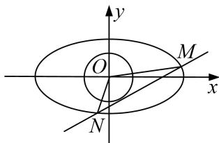

<!-- question-source:start -->
4. 已知椭圆 $C: \frac{x^2}{a^2} + \frac{y^2}{b^2} = 1 (a > b > 0)$ 上的点到两个焦点的距离之和为 $\frac{2}{3}$ ，短轴长为 $\frac{1}{2}$ ，直线 $l$ 与椭圆 $C$ 交于 $M, N$ 两点.

(1)求椭圆 C 的方程;

(2)若直线 $l$ 与圆 $O: x^{2} + y^{2} = \frac{1}{25}$ 相切，求证： $\overrightarrow{OM} \cdot \overrightarrow{ON}$ 为定值.

<!-- question-source:end -->

![[高中/总复习/专题/圆锥曲线/专题21  数量积、角度及参数型定值问题-圆锥曲线/专题21_数量积_角度及参数型定值问题/题型一_数量积型定值问题/对点训练/题目/answers/Q00032808A1.md]]
