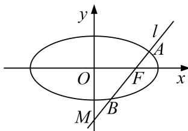

<!-- question-source:start -->
[例 2] 已知椭圆 C 的焦点在 x 轴上，离心率等于 $\frac{2\sqrt{5}}{5}$ ，且过点 $\left(1, \frac{2\sqrt{5}}{5}\right)$ .

(1)求椭圆 C 的标准方程;

(2)过椭圆 $C$ 的右焦点 $F$ 作直线 $l$ 交椭圆 $C$ 于 $A, B$ 两点，交 $y$ 轴于 $M$ 点，若 $\overrightarrow{MA} = \lambda_1\overrightarrow{AF}$ ， $\overrightarrow{MB} = \lambda_2\overrightarrow{BF}$ ，求证： $\lambda_1 + \lambda_2$ 为定值.

(2)证明：设 $A(x_{1}, y_{1})$ ， $B(x_{2}, y_{2})$ ， $M(0, y_{0})$ ，又易知 F 点的坐标为 $(2, 0)$ .

显然直线 l 存在斜率，设直线 l 的斜率为 k，则直线 l 的方程是 $y=k(x-2)$ ，

将直线 l 的方程代入椭圆 C 的方程中，消去 y 并整理得 $(1+5k^{2})x^{2}-20k^{2}x+20k^{2}-5=0$ ，

$$
\therefore x _ {1} + x _ {2} = \frac {2 0 k ^ {2}}{1 + 5 k ^ {2}}, x _ {1} x _ {2} = \frac {2 0 k ^ {2} - 5}{1 + 5 k ^ {2}}.
$$

又∵ $\overrightarrow{MA}=\lambda_{1}\overrightarrow{AF}$ ， $\overrightarrow{MB}=\lambda_{2}\overrightarrow{BF}$ ，将各点坐标代入得 $\lambda_{1}=\frac{x_{1}}{2-x_{1}}$ ， $\lambda_{2}=\frac{x_{2}}{2-x_{2}}$

$\therefore \lambda_{1} + \lambda_{2} = \frac{x_{1}}{2 - x_{1}} +\frac{x_{2}}{2 - x_{2}} = \frac{2(x_{1} + x_{2}) - 2x_{1}x_{2}}{4 - 2(x_{1} + x_{2}) + x_{1}x_{2}} = \frac{\left( \frac{20k^{2}}{1 + 5k^{2}} - \frac{20k^{2} - 5}{1 + 5k^{2}}\right)}{4 - 2\cdot\frac{20k^{2}}{1 + 5k^{2}} + \frac{20k^{2} - 5}{1 + 5k^{2}}} = -10$ ，即 $\lambda_1 + \lambda_2$ 为定值.
<!-- question-source:end -->

![[高中/总复习/专题/圆锥曲线/专题21  数量积、角度及参数型定值问题-圆锥曲线/专题21_数量积_角度及参数型定值问题/题型三_参数型定值问题/例题选讲/例题/answers/Q00032816A1.md]]
