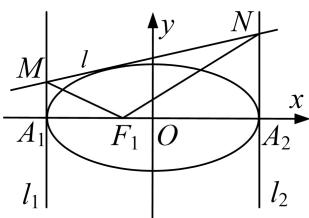

<!-- question-source:start -->
1. 已知椭圆 $C: \frac{x^2}{a^2} + \frac{y^2}{b^2} = 1 (a > b > 0)$ 的离心率为 $\frac{1}{3}$ ，左、右焦点分别为 $F_1, F_2, A$ 为椭圆 $C$ 上一点， $AF_2 \perp F_1F_2$ ，且 $|AF_2| = \frac{8}{3}$ .

(1)求椭圆 C 的方程;

(2)设椭圆 C 的左、右顶点分别为 $A_{1}$ ， $A_{2}$ ，过 $A_{1}$ ， $A_{2}$ 分别作 x 轴的垂线 $l_{1}$ ， $l_{2}$ ，椭圆 C 的一条切线 l: y = kx + m 与 $l_{1}$ ， $l_{2}$ 分别交于 M，N 两点，求证： $\angle MF_{1}N$ 为定值.

<!-- question-source:end -->

![[高中/总复习/专题/圆锥曲线/专题21  数量积、角度及参数型定值问题-圆锥曲线/专题21_数量积_角度及参数型定值问题/题型二_角度型定值问题/对点训练/题目/answers/Q00032813A1.md]]
