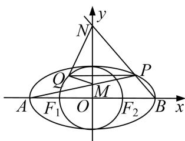

<!-- question-source:start -->
2. 已知椭圆 $C: \frac{x^2}{a^2} + \frac{y^2}{b^2} = 1 (a > b > 0)$ 上的点到它的两个焦的距离之和为 4，以椭圆 $C$ 的短轴为直径的圆

O 经过这两个焦点，点 A，B 分别是椭圆 C 的左、右顶点.

(1)求圆和椭圆的方程.

(2)已知 $P, Q$ 分别是椭圆 $C$ 和圆 $O$ 上的动点（ $P, Q$ 位于 $y$ 轴两侧），且直线 $PQ$ 与 $x$ 轴平行，直线 $AP, BP$ 分别与 $y$ 轴交于点 $M, N$ . 求证： $\angle MQN$ 为定值.

<!-- question-source:end -->

![[高中/总复习/专题/圆锥曲线/专题21  数量积、角度及参数型定值问题-圆锥曲线/专题21_数量积_角度及参数型定值问题/题型二_角度型定值问题/对点训练/题目/answers/Q00032814A1.md]]
