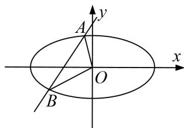

<!-- question-source:start -->
[例4] 设 $F_{1}, F_{2}$ 分别是椭圆 $E: \frac{x^{2}}{4} + \frac{y^{2}}{b^{2}} = 1 (b > 0)$ 的左、右焦点，若 $P$ 是该椭圆上的一个动点，且 $\overrightarrow{PF_1} \cdot \overrightarrow{PF_2}$ 的最大值为1.

(1)求椭圆 E 的方程;

(2)设直线 $l: x = ky - 1$ 与椭圆 $E$ 交于不同的两点 $A, B$ , 且 $\angle AOB$ 为锐角 ( $O$ 为坐标原点), 求 $k$ 的取值范围.

[规范解答]
<!-- question-source:end -->

![[高中/总复习/专题/圆锥曲线/专题22  斜率型取值范围模型-圆锥曲线/专题22__斜率型取值范围模型/例题/answers/Q00042558A1.md]]
