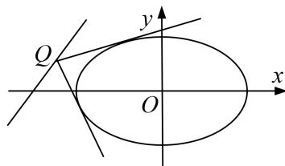

<!-- question-source:start -->
4. 在圆 $x^{2} + y^{2} = 9$ 上任取一点 $P$ , 过点 $P$ 作 $x$ 轴的垂线段 $PD$ , $D$ 为垂足. 点 $M$ 在线段 $DP$ 上, 满足 $\frac{|DM|}{|DP|} = \frac{2}{3}$ . 当点 $P$ 在圆上运动时, 设点 $M$ 的轨迹为曲线 $C$ .

(1)求曲线 C 的方程;

(2)若直线 $y=m(x+5)$ 上存在点 Q，使得过点 Q 作曲线 C 的两条切线相互垂直，求实数 m 的取值范围.

<!-- question-source:end -->

![[高中/总复习/专题/圆锥曲线/专题22  斜率型取值范围模型-圆锥曲线/专题22__斜率型取值范围模型/对点训练/answers/Q00042564A1.md]]
