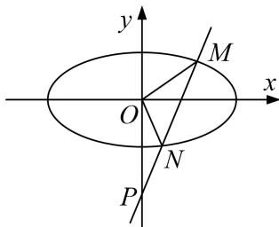

<!-- question-source:start -->
5. 已知点 $P(0, -2)$ , 点 $A, B$ 分别为椭圆 $E: \frac{y^2}{a^2} + \frac{x^2}{b^2} = 1 (a > b > 0)$ 的左右顶点, 直线 $BP$ 交 $E$ 于点 $Q$ , $\triangle ABP$

是等腰直角三角形，且 $\overrightarrow{PQ}=\frac{3}{2}\overrightarrow{QB}$ .

(1)求 $E$ 的方程;

(2)设过点 $P$ 的动直线 $l$ 与 $E$ 相交于 $M, N$ 两点，当坐标原点 $O$ 位于 $MN$ 以为直径的圆外时，求直线 $l$ 斜率的取值范围.

<!-- question-source:end -->

![[高中/总复习/专题/圆锥曲线/专题22  斜率型取值范围模型-圆锥曲线/专题22__斜率型取值范围模型/对点训练/answers/Q00042565A1.md]]
