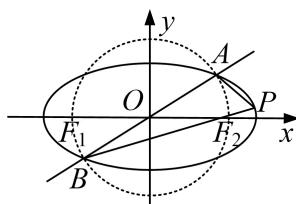

> [!faq]- 《专题22  斜率型取值范围模型(教师版)》例题解析
>
> > [!success]- **【答案】** 详见解析
>
> > [!note]- **【解析】**
> > (2)的条件下，设 $P(x_0, y_0)$ 为椭圆上一点，且直线 $PA$ 的斜率 $k_1 \in (-2, -1)$ ，试求直线 $PB$ 的斜率 $k_2$ 的取值范围.
> >
> > 
> >
> > [规范解答]
> > (1)由题意得 c=3，根据 $2a+2c=16$ ，得 a=5.
> >
> > 结合 $a^{2}=b^{2}+c^{2}$ ，解得 $a^{2}=25,\ b^{2}=16$ 。所以椭圆的方程为 $\frac{x^{2}}{25}+\frac{y^{2}}{16}=1$ 。
> >
> > (2)法一：由 $\left\{ \begin{array}{l} \frac{x^2}{a^2} + \frac{y^2}{b^2} = 1, \\ y = \frac{\sqrt{2}}{4} x, \end{array} \right.$ 得 $\left(b^2 + \frac{1}{8} a^2\right)x^2 - a^2 b^2 = 0.$
> >
> > 设 $A(x_{1},y_{1}),B(x_{2},y_{2})$ ，所以 $x_{1} + x_{2} = 0$ ， $x_{1}x_{2} = \frac{-a^{2}b^{2}}{b^{2} + \frac{1}{8}a^{2}}$ ，由 $AB$ ， $F_{1}F_{2}$ 互相平分且共圆，
> >
> > 易知， $AF_{2}\perp BF_{2}$ ，因为 $\overrightarrow{F_{2}A}=(x_{1}-3,y_{1})$ ， $\overrightarrow{F_{2}B}=(x_{2}-3,y_{2})$
> >
> > $$
> > \text {以} \overrightarrow {F _ {2}} A \cdot \overrightarrow {F _ {2}} B = (x _ {1} - 3) (x _ {2} - 3) + y _ {1} y _ {2} = \left(1 + \frac {1}{8}\right) x _ {1} x _ {2} + 9 = 0.
> > $$
> >
> > 即 $x_{1}x_{2} = -8$ ，所以有 $\frac{-a^2b^2}{b^2 + \frac{1}{8}a^2} = -8$ ，结合 $b^{2} + 9 = a^{2}$ ，解得 $a^2 = 12(a^2 = 6$ 舍去），
> >
> > $$
> > e = \frac {\sqrt {3}}{2}
> > $$
> >
> > $$
> > A (x _ {1}, y _ {1})
> > $$
> >
> > $$
> > F _ {1} F _ {2}
> > $$
> >
> > 所以 AB, $F_{1}F_{2}$ 是圆的直径，所以 $x_{1}^{2} + y_{1}^{2} = 9$ ，又由椭圆及直线方程综合可得： $\left\{\begin{aligned}x_{1}^{2}+y_{1}^{2}&=9,\\ y_{1}&=\frac{\sqrt{2}}{4}x_{1},\\ \frac{x_{1}^{2}}{a^{2}}+\frac{y_{1}^{2}}{b^{2}}&=1.\end{aligned}\right.$ 由前两个方程解得 $x_{1}^{2}=8,\quad y_{1}^{2}=1$ ，将其代入第三个方程并结合 $b^{2}=a^{2}-c^{2}=a^{2}-9$
> >
> > $$
> > a ^ {2} = 1 2
> > $$
> >
> > $$
> > e = \frac {\sqrt {3}}{2}
> > $$
> >
> > (3)由
> > (2)的结论知，椭圆方程为 $\frac{x^{2}}{12}+\frac{y^{2}}{3}=1$ ，由题可设 $A(x_{1},y_{1})$ ， $B(-x_{1},-y_{1})$ ， $k_{1}=\frac{y_{0}-y_{1}}{x_{0}-x_{1}}$ ， $k_{2}=\frac{y_{0}+y_{1}}{x_{0}+x_{1}}$ ，所以 $k_{1}k_{2}=\frac{y_{0}^{2}-y_{1}^{2}}{x_{0}^{2}-x_{1}^{2}}$ ，又 $\frac{y_{0}^{2}-y_{1}^{2}}{x_{0}^{2}-x_{1}^{2}}=\frac{3\left(1-\frac{x_{0}^{2}}{12}\right)-3\left(1-\frac{x_{1}^{2}}{12}\right)}{x_{0}^{2}-x_{1}^{2}}=-\frac{1}{4}$ 即 $k_{2}=-\frac{1}{4k_{1}}$ ，由 $-2<k_{1}<-1$ 可知， $\frac{1}{8}<k_{2}<\frac{1}{4}$ 。即直线 PB 的斜率 $k_{2}$ 的取值范围是 $\left(\frac{1}{8},\frac{1}{4}\right)$ .
