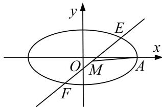

> [!faq]- 《专题22  斜率型取值范围模型(教师版)》例题解析
>
> > [!success]- **【答案】** 详见解析
>
> > [!note]- **【解析】**
> > (1)求椭圆 C 的方程;
> >
> > (2)过点 $\left(\frac{1}{2}, 0\right)$ 作直线 $l$ 与椭圆 $C$ 交于 $E, F$ 两点，线段 $EF$ 的中点为 $M$ ，点 $A$ 是椭圆 $C$ 的右顶点，求直线 $MA$ 的斜率 $k$ 的取值范围.
> >
> > 6. 解析
> > (1) $\because$ 椭圆 $C$ 过点 $\left(1, \frac{3}{2}\right)$ , $\therefore \frac{1}{a^2} + \frac{9}{4b^2} = 1$ , ①
> >
> > 
> >
> > ∵椭圆 C 关于直线 x=c 对称的图形过坐标原点，∴a=2c，∵ $a^{2}=b^{2}+c^{2}$ ，∴ $b^{2}=\frac{3}{4}a^{2}$ ，②
> > 由①②得 $a^{2}=4,\quad b^{2}=3,\quad$ ∴椭圆 C 的方程为 $\frac{x^{2}}{4}+\frac{y^{2}}{3}=1$ .
> >
> > (2)依题意，直线 l 过点 $\left(\frac{1}{2}, 0\right)$ 且斜率不为零，故可设其方程为 $x=my+\frac{1}{2}$ .
> >
> > 由方程组 $\left\{\begin{aligned}x&=my+\frac{1}{2},\\ \frac{x^{2}}{4}&+\frac{y^{2}}{3}=12\end{aligned}\right.$ 消去x，并整理得 $4(3m^{2}+4)y^{2}+12my-45=0.$
> >
> > 设 $E(x_{1},y_{1}),F(x_{2},y_{2}),M(x_{0},y_{0}),\therefore y_{1} + y_{2} = -\frac{3m}{3m^{2} + 4},\therefore y_{0} = \frac{y_{1} + y_{2}}{2} = -\frac{3m}{23m^{2} + 4},$
> >
> > $$
> > \therefore x _ {0} = m y _ {0} + \frac {1}{2} = \frac {2}{3 m ^ {2} + 4}, \quad \therefore k = \frac {y _ {0}}{x _ {0} - 2} = \frac {m}{4 m ^ {2} + 4}.
> > $$
> > - **①**：当 m=0 时，k=0.
> > - **②**：当 $m \neq 0$ 时， $k = \frac{1}{4m + \frac{4}{m}}$ ，当 m > 0 时， $4m + \frac{4}{m} \geq 8$ ，∴ $0 < \frac{1}{4m + \frac{4}{m}} \leq \frac{1}{8}$ . ∴ $0 < k \leq \frac{1}{8}$ ,
> >
> > 当 $m < 0$ 时， $4m + \frac{4}{m} = -(-4m) + \frac{4}{-m} \leq -8, \therefore -\frac{1}{8} \leq \frac{1}{4m + \frac{4}{m}} = k < 0. \therefore -\frac{1}{8} \leq k \leq \frac{1}{8}$ 且 $k \neq 0$ .
> >
> > 综合①、②可知，直线 $MA$ 的斜率 $k$ 的取值范围是 $\left[-\frac{1}{8}, \frac{1}{8}\right]$ .
