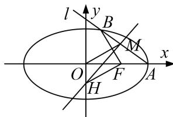
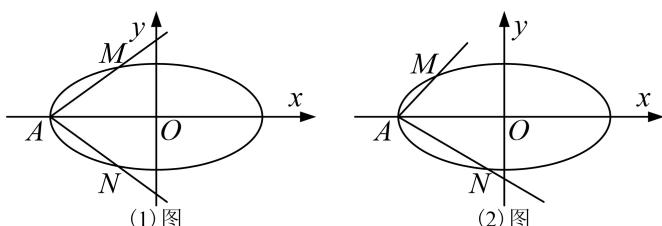

<!-- question-source:start -->
[例1] 设椭圆 $\frac{x^2}{a^2} + \frac{y^2}{3} = 1 (a > \sqrt{3})$ 的右焦点为 $F$ ，右顶点为 $A$ 。已知 $|OA| - |OF| = 1$ ，其中 $O$ 为原点，e 为椭圆的离心率。

(1)求椭圆的方程及离心率 e 的值;

(2)设过点 $A$ 的直线 $l$ 与椭圆交于点 $B(B$ 不在 $x$ 轴上), 垂直于 $l$ 的直线与 $l$ 交于点 $M$ , 与 $y$ 轴交于点 $H$ . 若 $BF \perp HF$ , 且 $\angle MOA \leq \angle MAO$ , 求直线 $l$ 的斜率的取值范围.

[破题思路] 由题目条件垂直于直线 l 的直线与 l 交于点 M，与 y 轴交于点 H，利用 $k \cdot k_{MH} = -1$ ，建立关于 k 的两条直线方程，由题目条件 $\angle MOA \leq \angle MAO$ ，利用三角形的大角对大边，建立关于 $x_{M}$ 的不等式，利用题目条件 $BF \perp HF$ ，即 $\overrightarrow{BF} \cdot \overrightarrow{HF} = 0$ 建立关系式.

(1)由题意可知 $|OF|=c=\sqrt{a^{2}-3}$ ，又 $|OA|-|OF|=1$ ，所以 $a-\sqrt{a^{2}-3}=1$ ，解得a=2，

所以椭圆的方程为 $\frac{x^{2}}{4}+\frac{y^{2}}{3}=1$ ，离心率 $e=\frac{c}{a}=\frac{1}{2}$ .

(2)设 $M(x_{M}, y_{M})$ ，易知 $A(2, 0)$ ，在 $\triangle MAO$ 中， $\angle MOA \leq \angle MAO \Leftrightarrow |MA| \leq |MO|$ ,

即 $(x_{M} - 2)^{2} + y_{M}^{2}\leq x_{M}^{2} + y_{M}^{2}$ ，化简得 $x_{M}\geq 1$

设直线 l 的斜率为 $k(k \neq 0)$ ，则直线 l 的方程为 $y = k(x - 2)$ .

设 $B(x_{B},y_{B})$ ，联立 $\left\{ \begin{array}{l}x^{2} + \frac{y^{2}}{3} = 1,\\ y = k(x - 2) \end{array} \right.$ 消去 $y$ ，整理得 $(4k^{2} + 3)x^{2} - 16k^{2}x + 16k^{2} - 12 = 0,$ 解得 $x = 2$ 或 $x = \frac{8k^2 - 6}{4k^2 + 3}$ .由题意得 $x_{B} = \frac{8k^{2} - 6}{4k^{2} + 3}$ ，从而 $y_{B} = \frac{-12k}{4k^{2} + 3}$ 由(1)知 $F(1,0)$ ，设 $H(0,y_H)$ ，则 $\overrightarrow{FH} = (-1,y_H),\overrightarrow{BF} = \left[\frac{9 - 4k^2}{4k^2 + 3},\frac{12k}{4k^2 + 3}\right].$ 由 $BF\bot HF$ ，得 $\overrightarrow{BF}\cdot \overrightarrow{FH} = 0$ ，即 $\frac{4k^2 - 9}{4k^2 + 3} +\frac{12ky_H}{4k^2 + 3} = 0$ ，解得 $y_{H} = \frac{9 - 4k^{2}}{12k}$ 所以直线 $MH$ 的方程为 $y = -\frac{1}{k} x + \frac{9 - 4k^2}{12k}.$ 由 $\left\{ \begin{array}{l}y = k(x - 2),\\ y = -\frac{1}{k} x + \frac{9 - 4k^2}{12k}, \end{array} \right.$ 消去 $y$ ，得 $x_{M} = \frac{20k^{2} + 9}{12(k^{2} + 1)}.$ 由 $x_{M}\geq 1$ ，得 $\frac{20k^2 + 9}{12(k^2 + 1)}\geq 1$ ，解得 $k\leq -\frac{\sqrt{6}}{4}$ 或 $k\geq \frac{\sqrt{6}}{4}$ 所以直线 $l$ 的斜率的取值范围为 $\left[-\infty , - \frac{\sqrt{6}}{4}\right]\cup \left[\frac{\sqrt{6}}{4}, + \infty \right].$

[题后悟通] 利用已知条件中的几何关系构建目标不等式的核心是用转化与化归的数学思想，将几何关系转化为代数不等式，从而构建出目标不等式.
<!-- question-source:end -->

![[高中/总复习/专题/圆锥曲线/专题22  斜率型取值范围模型-圆锥曲线/专题22_斜率型取值范围模型/例题选讲/例题/answers/Q00032599A1.md]]
