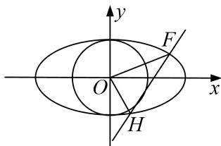

<!-- question-source:start -->
[例5] 已知 $C$ 为圆 $(x + 1)^2 + y^2 = 8$ 的圆心， $P$ 是圆上的动点，点 $Q$ 在圆的半径 $CP$ 上，且有点 $A(1,0)$ 和 $AP$ 上的点 $M$ ，满足 $\overrightarrow{MQ} \cdot \overrightarrow{AP} = 0$ ， $\overrightarrow{AP} = 2\overrightarrow{AM}$ .

(1)当点 P 在圆上运动时，求点 Q 的轨迹方程；

(2)若斜率为 k 的直线 l 与圆 $x^{2}+y^{2}=1$ 相切，与(1)中所求点 Q 的轨迹交于不同的两点 F, H, O 是坐标原点，且 $\frac{3}{4}\leq\overrightarrow{OF}\cdot\overrightarrow{OH}\leq\frac{4}{5}$ ，求 k 的取值范围.

(2)设直线 $l: y = kx + t, F(x_1, y_1), H(x_2, y_2)$ ，直线 $l$ 与圆 $x^2 + y^2 = 1$ 相切 $\Rightarrow \frac{|t|}{\sqrt{k^2 + 1}} = 1 \Rightarrow t^2 = k^2 + 1$ .

联立 $\left\{\begin{aligned}\frac{x^{2}}{2}+y^{2}=1,\\ y=kx+t\end{aligned}\right.$ $\Rightarrow(1+2k^{2})x^{2}+4ktx+2t^{2}-2=0,$

则 $\Delta=16k^{2}t^{2}-4(1+2k^{2})(2t^{2}-2)=8(2k^{2}-t^{2}+1)=8k^{2}>0\Rightarrow k\neq0,\quad x_{1}+x_{2}=\frac{-4kt}{1+2k^{2}},\quad x_{1}x_{2}=\frac{2t^{2}-2}{1+2k^{2}}$

$$
\overrightarrow {O F} \cdot \overrightarrow {O H} = x _ {1} x _ {2} + y _ {1} y _ {2} = (1 + k ^ {2}) x _ {1} x _ {2} + k t \left(x _ {1} + x _ {2}\right) + t ^ {2} = \frac {(1 + k ^ {2}) (2 t ^ {2} - 2)}{1 + 2 k ^ {2}} + k t \frac {- 4 k t}{1 + 2 k ^ {2}} + t ^ {2}
$$

$$
\frac {(1 + k ^ {2}) 2 k ^ {2}}{1 + 2 k ^ {2}} - \frac {4 k ^ {2} (k ^ {2} + 1)}{1 + 2 k ^ {2}} + k ^ {2} + 1 = \frac {1 + k ^ {2}}{1 + 2 k ^ {2}},
$$

所以 $\frac{3}{4} < \frac{1 + k^2}{1 + 2k^2} < \frac{4}{5} \Rightarrow \frac{1}{3} < k^2 < \frac{1}{2} \Rightarrow \frac{\sqrt{3}}{3} \leq |k| < \frac{\sqrt{2}}{2}$ ，所以 $-\frac{\sqrt{2}}{2} < k < -\frac{\sqrt{3}}{3}$ 或 $\frac{\sqrt{3}}{3} < k < \frac{\sqrt{2}}{2}$ .

故 $k$ 的取值范围是 $\left[-\frac{\sqrt{2}}{2}, -\frac{\sqrt{3}}{3}\right] \cup \left[\frac{\sqrt{3}}{3}, \frac{\sqrt{2}}{2}\right]$ .
<!-- question-source:end -->

![[高中/总复习/专题/圆锥曲线/专题22  斜率型取值范围模型-圆锥曲线/专题22_斜率型取值范围模型/例题选讲/例题/answers/Q00032603A1.md]]
