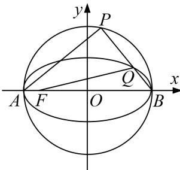

<!-- question-source:start -->
[例6] 已知 $M$ 为椭圆 $C: \frac{x^2}{25} + \frac{y^2}{9} = 1$ 上的动点，过点 $M$ 作 $x$ 轴的垂线，垂足为 $D$ ，点 $P$ 满足 $\overrightarrow{PD} = \frac{5}{3}\overrightarrow{MD}$ . (1)求动点 $P$ 的轨迹 $E$ 的方程；

(2)若 A, B 两点分别为椭圆 C 的左、右顶点，F 为椭圆 C 的左焦点，直线 PB 与椭圆 C 交于点 Q，直线 QF，PA 的斜率分别为 $k_{QF}$ ， $k_{PA}$ ，求 $\frac{k_{QF}}{k_{PA}}$ 的取值范围.

(2)依题意知 $A(-5,0)$ , $B(5,0)$ , $F(-4,0)$ , 设 $\mathrm{Q}(x_0,y_0)$ ,

∵线段 AB 为圆 E 的直径，∴ $AP \perp BP$ ，设直线 PB 的斜率为 $k_{PB}$ ，

$$
\sqrt {\frac {k _ {Q F}}{k _ {P A}}} = \frac {k _ {Q F}}{- \frac {1}{k _ {P B}}} = - k _ {Q F} k _ {P B} = - k _ {Q F} k _ {Q B} = - \frac {y _ {0}}{x _ {0} + 4} \cdot \frac {y _ {0}}{x _ {0} - 5} = - \frac {y _ {0} ^ {2}}{(x _ {0} + 4) (x _ {0} - 5)}
$$

$$
= - \frac {9 \left(1 - \frac {x _ {0} ^ {2}}{2 5}\right)}{\left(x _ {0} + 4\right) \left(x _ {0} - 5\right)} = \frac {\frac {9}{2 5} \left(x _ {0} ^ {2} - 2 5\right)}{\left(x _ {0} + 4\right) \left(x _ {0} - 5\right)} = \frac {\frac {9}{2 5} \left(x _ {0} + 5\right)}{x _ {0} + 4} = \frac {9}{2 5} \left(1 + \frac {1}{x _ {0} + 4}\right),
$$

∵点 P 不同于 A，B 两点且直线 QF 的斜率存在，∴-5<x\_{0}<5 且 x\_{0}≠-4，

又 $y = \frac{1}{x + 4}$ 在 $(-5, -4)$ 和 $(-4, 5)$ 上都是减函数， $\therefore \frac{9}{25} \left[ 1 + \frac{1}{x_0 + 4} \right] \in (-\infty, 0) \cup \left[ \frac{2}{5}, +\infty \right]$ ,

故 $\frac{k_{QF}}{k_{PA}}$ 的取值范围是 $(-∞, 0)∪\left(\frac{2}{5}, +∞\right)$ .
<!-- question-source:end -->

![[高中/总复习/专题/圆锥曲线/专题22  斜率型取值范围模型-圆锥曲线/专题22_斜率型取值范围模型/例题选讲/例题/answers/Q00032604A1.md]]
