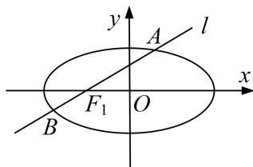

<!-- question-source:start -->
1. 已知椭圆 $C$ 的两个焦点为 $F_{1}(-1, 0)$ , $F_{2}(1, 0)$ , 且经过点 $E(\sqrt{3}, \frac{\sqrt{3}}{2})$ .

(1)求椭圆 C 的方程;

(2)过点 $F_{1}$ 的直线 $l$ 与椭圆 $C$ 交于 $A, B$ 两点(点 $A$ 位于 $x$ 轴上方)，若 $\overrightarrow{AF_1} = \lambda \overrightarrow{F_1B}$ ，且 $2 \leq \lambda < 3$ ，求直线 $l$ 的斜率 $k$ 的取值范围.

<!-- question-source:end -->

![[高中/总复习/专题/圆锥曲线/专题22  斜率型取值范围模型-圆锥曲线/专题22_斜率型取值范围模型/对点训练/题目/answers/Q00032605A1.md]]
