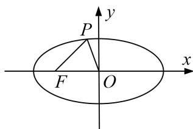

<!-- question-source:start -->
2. 已知椭圆 $\frac{x^2}{a^2} + \frac{y^2}{b^2} = 1 (a > b > 0)$ 的左焦点为 $F(-c, 0)$ ，离心率为 $\frac{\sqrt{3}}{3}$ ，点 $M$ 在椭圆上且位于第一象限，直线 $FM$ 被圆 $x^2 + y^2 = \frac{b^2}{4}$ 截得的线段的长为 $c$ ， $|FM| = \frac{4\sqrt{3}}{3}$ .

(1)求直线 FM 的斜率;

(2)求椭圆的方程;

(3)设动点 P 在椭圆上，若直线 FP 的斜率大于 $\sqrt{2}$ ，求直线 $OP(O$ 为原点 $)$ 的斜率的取值范围.

<!-- question-source:end -->

![[高中/总复习/专题/圆锥曲线/专题22  斜率型取值范围模型-圆锥曲线/专题22_斜率型取值范围模型/对点训练/题目/answers/Q00032606A1.md]]
